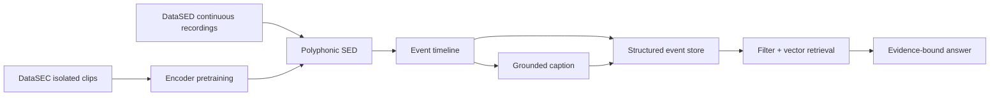

# Grounded Environmental Audio Monitoring and RAG-based Event Retrieval

Khóa luận Khoa học dữ liệu về phát hiện sự kiện âm thanh môi trường, sinh mô tả có căn cứ và truy xuất sự kiện bằng RAG.

> **Trạng thái:** hai dataset đã tải và verify (MD5 khớp, license `cc-by-nc-sa-4.0`).
> Taxonomy 22 lớp + 28 subclass đã xác minh từ archive. SED baseline đã chạy nhưng
> là số dò đường, chưa phải kết quả. Cổng đang chặn: **D3 audit duplicate**.
> Chi tiết có bằng chứng: [STATUS](docs/STATUS.md).

## 1. Bài toán

Hệ thống nhận recording môi trường dài, phát hiện class cùng onset/offset, tạo caption chỉ từ event timeline, lưu event có cấu trúc và trả lời truy vấn dựa trên bằng chứng đã lưu.

```text
audio → SED → event timeline → grounded caption → event store → hybrid retrieval
```

Phạm vi dữ liệu:

- **DataSEC:** clip sự kiện tách rời; dùng cho pretraining, classification và subclass refinement.
- **DataSED:** recording thực tế liên tục; dùng cho temporal/polyphonic SED và benchmark chính.

Hệ thống không tuyên bố phát hiện tội phạm, ý định, tình trạng khẩn cấp hay sự cố trường học. Output mô tả nguồn âm quan sát được.

## 2. Câu hỏi nghiên cứu

1. Pretraining trên DataSEC cải thiện SED trên DataSED đến mức nào?
2. Caption bị ràng buộc bởi event timeline giảm hallucination đến mức nào so với caption không ràng buộc?
3. Kết hợp metadata filtering và semantic retrieval cải thiện Recall@k/MRR cho truy vấn sự kiện ra sao?
4. Classifier phân cấp có tách được subclass DataSEC trong các coarse class gộp hay không?

## 3. Đóng góp dự kiến

- Pipeline tái lập từ archive công bố đến classification và polyphonic SED.
- Mô hình chuyển giao DataSEC → DataSED, có kiểm tra duplicate xuyên dataset.
- Caption có căn cứ, đo event hallucination và temporal-order agreement.
- RAG truy xuất recording theo class, thời gian, duration và quan hệ trước–sau.
- Ứng dụng web minh họa upload, timeline, caption và truy vấn.

## 4. Kiến trúc



Chi tiết: [SYSTEM](docs/SYSTEM.md), [DATA_PLAN](docs/DATA_PLAN.md), [taxonomy](docs/taxonomy.md), [evaluation protocol](docs/evaluation_protocol.md).

## 5. Cấu trúc repository

```text
environmental-audio-rag/
├── contracts/          # schema giao tiếp giữa data, model và service
├── data/               # raw/interim/features/annotations/manifests/splits
├── docs/               # đặc tả, kế hoạch, protocol, ADR, measurements
├── ml/                 # datasets, features, models, training, evaluation
├── notebooks/          # chỉ dùng khám phá; logic chính phải vào ml/ hoặc scripts/
├── scripts/            # entry point tái lập pipeline
├── services/           # api, inference, frontend, stream
└── tests/              # contract, unit và integration tests
```

## 6. Nguồn chân lý

| Nội dung | File | Khi nào đọc |
|---|---|---|
| **Đang ở đâu, làm gì tiếp** | [CLAUDE.md](CLAUDE.md) | **Đầu mỗi phiên** |
| Đặc tả hệ thống (khung báo cáo) | [docs/SYSTEM.md](docs/SYSTEM.md) | Khi cần chi tiết kỹ thuật |
| Trạng thái có bằng chứng | [docs/STATUS.md](docs/STATUS.md) | Khi cần số liệu hiện hành |
| Roadmap 8 tuần | [docs/PLAN.md](docs/PLAN.md) | Đầu mỗi tuần |
| Dữ liệu, dedup và split | [docs/DATA_PLAN.md](docs/DATA_PLAN.md) | Suốt giai đoạn D1–D4 |
| 22 lớp và ranh giới | [docs/taxonomy.md](docs/taxonomy.md) | Khi làm việc với nhãn hoặc caption |
| Xử lý nhãn | [docs/annotation_guideline.md](docs/annotation_guideline.md) | Khi viết parser nhãn |
| **Số nào có nghĩa, số đó KHÔNG nói gì** | [docs/evaluation_protocol.md](docs/evaluation_protocol.md) | **Trước khi báo cáo bất kỳ con số nào** |
| Vận hành huấn luyện | [docs/TRAINING_OPS_PLAN.md](docs/TRAINING_OPS_PLAN.md) | Trước lần train mới |
| Văn liệu và mức xác minh | [docs/RELATED_WORK.md](docs/RELATED_WORK.md) | Khi viết Chương 2 |
| Inventory (sinh tự động) | [docs/data_inventory.md](docs/data_inventory.md) | Khi cần số liệu dữ liệu |
| Quyết định kiến trúc | [docs/decisions/](docs/decisions/) | Khi định thay đổi kiến trúc |
| Số đo (sinh tự động) | [docs/measurements/](docs/measurements/) | Khi cần bằng chứng cho một claim |

## 7. Nguyên tắc

- Không commit raw audio, feature tensor, checkpoint hoặc vector index.
- Không sửa nhãn nguồn để làm đẹp kết quả; mọi exclusion cần reason code.
- Không dùng DataSED test để chọn threshold, duration prior hoặc checkpoint.
- Caption không được thêm event ngoài timeline đầu vào.
- Mọi số liệu trong báo cáo phải truy ngược được tới manifest, config và model artifact.

## 8. Dữ liệu và license

Hai dataset dùng trong đề tài, cả hai **CC-BY-NC-SA-4.0**:

| Dataset | Record DOI | Files |
|---|---|---:|
| DataSEC | [10.5281/zenodo.17033970](https://doi.org/10.5281/zenodo.17033970) | 5,048 |
| DataSED | [10.5281/zenodo.15346092](https://doi.org/10.5281/zenodo.15346092) | 717 |

Tác giả: Fredianelli L., Artuso F., Pompei G., Licitra G., Iannace G., Akbaba A.

**Ràng buộc `SA` áp lên derivative:** feature, checkpoint và caption sinh từ dữ
liệu này nếu công bố phải cùng CC-BY-NC-SA-4.0, **không** được MIT/Apache. Code
pipeline là tác phẩm độc lập nên có thể license riêng. Chi tiết:
[DATA_PLAN §3](docs/DATA_PLAN.md).

Không archive nào chứa LICENSE hay README — license chỉ lấy được từ Zenodo record
metadata đã lưu trong `data/reference/`.

## 9. Bắt đầu

```bash
python -m venv .venv
.venv/Scripts/python.exe -m pip install -r requirements.txt
.venv/Scripts/python.exe -m pip install -r requirements-torch.txt     --index-url https://download.pytorch.org/whl/cu128

.venv/Scripts/python.exe -m pytest -q
.venv/Scripts/python.exe -m ruff check .
```

Lệnh tái lập pipeline: [CLAUDE.md §7](CLAUDE.md).
