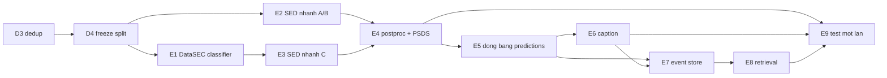

# PLAN.md — Master Plan 8 tuần

**Bắt đầu:** 22/09/2026 · **Deadline:** 09/11/2026 · **Buffer:** tới 16/11/2026

> Mỗi tuần chỉ hoàn tất khi đạt **Nghiệm thu** và cập nhật
> [STATUS.md](STATUS.md). "Code chạy" không phải nghiệm thu.

---

## Bảng trạng thái tổng

| Tuần | Ngày | Trọng tâm | Trạng thái |
|---|---|---|---|
| W1 | 22–28/09 | Cổng dữ liệu D1–D4 + tài liệu | ◐ đang chạy |
| W2 | 29/09–05/10 | DataSEC classifier + PANNs | ○ |
| W3 | 06–12/10 | SED ba nhánh + post-processing | ○ |
| W4 | 13–19/10 | Event-based F1, PSDS, phân tích lỗi | ○ |
| W5 | 20–26/10 | Grounded caption + metric hallucination | ○ |
| W6 | 27/10–02/11 | Event store + RAG + retrieval benchmark | ○ |
| W7 | 03–09/11 | API + frontend + test một lần | ○ |
| W8 | 10–16/11 | Buffer: viết báo cáo, vá lỗ hổng | ○ |

**Nếu không dùng buffer, W7 là tuần cuối.** Mọi thứ phải xong trước 09/11.

---

## Đồ thị phụ thuộc

**Đường găng: D3 → D4 → E2 → E4 → E5 → E6 → E9.** Trễ bất kỳ mắt nào trên đường
này là trễ toàn bộ. E1/E3 (transfer) và E7/E8 (RAG) nằm ngoài đường găng nên là
ứng viên cắt đầu tiên.

---

# W1 · 22–28/09 · Cổng dữ liệu và tài liệu

**Mục tiêu:** mở cổng D4 để mọi thí nghiệm sau đó hợp lệ.

### Tasks

| # | Task | Ước lượng | Trạng thái |
|---:|---|---|---|
| 1.1 | Verify MD5 hai archive | 0.5 h | ✅ |
| 1.2 | Archive audit + xác minh taxonomy | 2 h | ✅ |
| 1.3 | Git init + baseline commit | 0.5 h | ✅ |
| 1.4 | Viết lại SYSTEM/taxonomy/DATA_PLAN/evaluation_protocol | 6 h | ✅ |
| 1.5 | CLAUDE.md + 5 ADR | 3 h | ✅ |
| 1.6 | PLAN + STATUS + docs còn lại | 2 h | ◐ |
| 1.7 | **`scripts.find_duplicates` (T1/T2/T3)** | 6 h | ○ |
| 1.8 | **Chạy dedup, mở cổng D3** | 3 h | ○ |
| 1.9 | Giải nén + inventory DataSEC (D1) | 2 h | ○ |
| 1.10 | `scripts.check_leakage` + freeze split (D4) | 4 h | ○ |
| 1.11 | JSON Schema contracts + test | 3 h | ○ |
| 1.12 | CI baseline (ruff + pytest + guard api/torch) | 2 h | ○ |

### Nghiệm thu W1

- [ ] D1–D4 pass cho **cả hai** dataset
- [ ] `duplicate_groups.csv` và `exclusions.csv` đã commit
- [ ] Báo cáo dedup xuyên dataset trong `docs/measurements/`
- [ ] Split freeze, SHA-256 ghi lại, 5 kiểm leakage pass
- [ ] Tag `data-v1.0`
- [ ] CI xanh

> ⚠️ **Nếu D3 phát hiện trùng lặp > 5%**, RQ1 phải đổi cách diễn giải ngay tuần
> này, không để tới W3. Xem [DATA_PLAN §7.6](DATA_PLAN.md).

---

# W2 · 29/09–05/10 · DataSEC classifier và PANNs

### Tasks

| # | Task | Ước lượng |
|---:|---|---|
| 2.1 | Dataset loader DataSEC (22 coarse + 28 subclass) | 4 h |
| 2.2 | Class-balanced sampler + test | 3 h |
| 2.3 | Tích hợp PANNs CNN14, kiểm vừa 8 GB VRAM | 6 h |
| 2.4 | `logmel_panns_v1` theo cấu hình PANNs | 3 h |
| 2.5 | Train classifier coarse (E1) | 4 h |
| 2.6 | Thêm subclass head + consistency loss | 5 h |
| 2.7 | Calibration (ECE) + per-class table | 3 h |
| 2.8 | Ablation A6: balanced vs uniform sampling | 4 h |

### Nghiệm thu W2

- [ ] Classifier coarse có macro-F1 + per-class table + run manifest hợp lệ
- [ ] Subclass head báo **hai** con số macro-F1 theo [ADR-0006](decisions/ADR-0006-danh-gia-subclass.md)
- [ ] 4 subclass low-support báo bằng số tuyệt đối
- [ ] PANNs chạy được trong 8 GB, ghi rõ batch size khả thi
- [ ] A6 có kết quả, kết luận ghi vào ADR-0002

---

# W3 · 06–12/10 · SED ba nhánh

**Tuần quan trọng nhất — nằm trên đường găng và chứa RQ1.**

### Tasks

| # | Task | Ước lượng |
|---:|---|---|
| 3.1 | Nhánh A: CNN+BiGRU scratch, split đã freeze | 4 h |
| 3.2 | Nhánh B: PANNs CNN14 → DataSED | 6 h |
| 3.3 | Nhánh C: PANNs → DataSEC → DataSED | 6 h |
| 3.4 | Lưu logit thô `predictions/{dev,test}.npz` | 3 h |
| 3.5 | Suy duration prior từ **train** | 3 h |
| 3.6 | Quét θ per-class trên **dev** | 4 h |
| 3.7 | Đóng băng `postproc.json` | 1 h |
| 3.8 | Ablation A2 (global vs per-class θ), A3 (median filter) | 4 h |

### Nghiệm thu W3

- [ ] Ba nhánh cùng split, cùng budget, cùng seed set
- [ ] `postproc.json` đóng băng, hiệu chuẩn đúng nguồn ([ADR-0003](decisions/ADR-0003-threshold-va-post-processing.md))
- [ ] Logit thô lưu được, quét lại θ không cần train lại
- [ ] **Δ = C − B** tính được, kèm ghi chú kết quả D3

---

# W4 · 13–19/10 · Metric SED thật

### Tasks

| # | Task | Ước lượng |
|---:|---|---|
| 4.1 | Tích hợp `sed_eval`, event-based F1 (collar 0.2 s / 20%) | 4 h |
| 4.2 | Tích hợp `psds_eval`, hai scenario đóng băng | 5 h |
| 4.3 | Bootstrap CI theo **recording**, 1000 lần | 3 h |
| 4.4 | Phân tích lỗi: confusion, insertion/deletion/fragmentation/merging | 5 h |
| 4.5 | Hiệu năng theo duration / polyphony / confidence | 4 h |
| 4.6 | Cập nhật `confusable_with` từ ma trận nhầm thật | 2 h |
| 4.7 | Ablation A4 (`pos_weight` trần) | 4 h |
| 4.8 | Chạy 3 seed cho cấu hình cuối | 6 h |

### Nghiệm thu W4

- [ ] Event-based F1 và PSDS-1/PSDS-2 cho cả ba nhánh
- [ ] CI bootstrap theo recording cho mọi số chính
- [ ] Bảng phân tích lỗi per-class
- [ ] [taxonomy.md §8](taxonomy.md) cập nhật bằng cặp nhầm thật, kèm số lượt
- [ ] Nếu không đủ ngân sách cho 3 seed: ghi rõ và **không** tuyên bố Δ nhỏ có ý nghĩa

---

# W5 · 20–26/10 · Grounded caption

### Tasks

| # | Task | Ước lượng |
|---:|---|---|
| 5.1 | **E5: đóng băng SED predictions** | 2 h |
| 5.2 | Timeline canonicalizer + contract test | 4 h |
| 5.3 | Caption lexicon 22 lớp + lexicon cấm (G3) | 5 h |
| 5.4 | Template captioner (baseline) | 4 h |
| 5.5 | Bộ metric hallucination (C2) | 6 h |
| 5.6 | Nhánh unconstrained (đối chứng) | 5 h |
| 5.7 | Nhánh constrained | 8 h |
| 5.8 | Đánh giá oracle + end-to-end | 4 h |

### Nghiệm thu W5

- [ ] Ba ràng buộc G1/G2/G3 có **test tự động**, không kiểm bằng mắt
- [ ] Template captioner đạt hallucination = 0 (xác nhận harness đúng)
- [ ] Báo **cả** oracle và end-to-end
- [ ] Ba nhánh chạy trên **cùng** SED prediction đóng băng
- [ ] Caption lớp gộp nêu đúng mức không chắc chắn ([taxonomy.md §7](taxonomy.md))

---

# W6 · 27/10–02/11 · Event store và RAG

### Tasks

| # | Task | Ước lượng |
|---:|---|---|
| 6.1 | PostgreSQL + pgvector, schema + Alembic | 5 h |
| 6.2 | Nạp recordings/events/captions/caption_evidence | 4 h |
| 6.3 | Document builder (caption + event summary) | 3 h |
| 6.4 | Index BGE-M3 | 4 h |
| 6.5 | Structured filter + 4 temporal predicate | 5 h |
| 6.6 | Hybrid retriever | 4 h |
| 6.7 | Query set 100 câu + relevance tự động | 5 h |
| 6.8 | Answer generator có ràng buộc evidence | 5 h |
| 6.9 | Benchmark 3 cấu hình | 3 h |

### Nghiệm thu W6

- [ ] 4 temporal predicate chạy bằng SQL, có test
- [ ] `filter exactness` = **1.000** cho `hybrid` và `structured_only`
- [ ] Query set xây **trước** khi xem kết quả
- [ ] `unsupported-claim rate` = 0.000
- [ ] Bảng so sánh 3 cấu hình đầy đủ

---

# W7 · 03–09/11 · Ứng dụng và test một lần

### Tasks

| # | Task | Ước lượng |
|---:|---|---|
| 7.1 | `services/inference`: preprocessing + SED + postproc + caption | 6 h |
| 7.2 | `services/api`: upload, persistence, query (**không import torch**) | 6 h |
| 7.3 | Frontend: upload, timeline, caption, search, evidence | 8 h |
| 7.4 | Docker Compose đầu-cuối | 4 h |
| 7.5 | **E9: chạy test một lần, config đóng băng** | 4 h |
| 7.6 | Sinh toàn bộ measurement, cập nhật STATUS | 3 h |
| 7.7 | Đóng băng artifact, hướng dẫn tái lập | 3 h |

### Nghiệm thu W7

- [ ] Demo đầu-cuối: upload → timeline → caption → truy vấn có evidence
- [ ] CI xanh, guard `api` không import torch pass
- [ ] Test chạy **một lần**, mọi cấu hình đã chạy đều được báo cáo
- [ ] Mọi số trong báo cáo truy được về run manifest + split hash + taxonomy hash

---

# W8 · 10–16/11 · Buffer

Chỉ dùng nếu được gia hạn. Ưu tiên: viết báo cáo → vá lỗ hổng nghiệm thu →
hoàn thiện `RELATED_WORK.md` → làm đẹp giao diện.

---

## Cut-list — thứ tự hy sinh khi trễ

Cắt từ trên xuống. Không cắt nhảy cóc.

| # | Cắt gì | Mất gì | Vì sao cắt được |
|---:|---|---|---|
| 1 | Giao diện đẹp, animation | Điểm trình bày | Không ảnh hưởng kết quả khoa học |
| 2 | `services/stream` | Demo streaming | Đã ngoài phạm vi MVP |
| 3 | Ablation A4 (`pos_weight`) | Một bảng ablation | Không trả lời RQ nào |
| 4 | 3 seed → 1 seed | Khoảng tin cậy | **Phải ghi rõ và không tuyên bố Δ nhỏ có ý nghĩa** |
| 5 | Nhánh A (scratch) | Baseline dưới | RQ1 chỉ cần B và C |
| 6 | Nhánh constrained captioner | Một nửa RQ2 | Template vs unconstrained vẫn trả lời được một phần |
| 7 | Subclass head (RQ4) | RQ4 | Đóng góp phụ, không phải C1/C2/C3 |
| 8 | Frontend, chỉ giữ API | Demo trực quan | Kết quả khoa học không đổi |
| 9 | RAG answer generation, chỉ giữ retrieval | Một phần C4 | Retrieval metric vẫn trả lời RQ3 |

### Không bao giờ cắt

- Cổng D3/D4 và audit leakage — cắt là mọi kết quả mất giá trị
- Event-based F1 và PSDS — không có thì không có kết luận SED nào
- Bộ metric hallucination — là đóng góp C2
- Giao thức test một lần

---

## Nợ kỹ thuật và việc phải xác minh

| # | Hạng mục | Mức | Hạn |
|---:|---|---|---|
| 1 | `git.revision` của baseline là `"HEAD"`, `dirty: true` — **không tái lập được** | CAO | W3 (train lại) |
| 2 | `find_duplicates` và `check_leakage` chưa có | **CHẶN** | W1 |
| 3 | Chưa lưu logit thô → mỗi lần đổi θ phải chạy lại inference | CAO | W3 |
| 4 | Manifest thiếu `data_manifest_sha256` và `postproc` | TRUNG BÌNH | W3 |
| 5 | Chưa chứng minh đã seed torch/numpy/python đầy đủ | TRUNG BÌNH | W2 |
| 6 | `RELATED_WORK.md` còn `⚠️ CẦN XÁC MINH`, chưa có DOI | TRUNG BÌNH | W8 |
| 7 | Ngưỡng T3 0.95/0.85 chưa hiệu chuẩn | TRUNG BÌNH | W1 |
| 8 | Percentile 5/50 cho duration prior chưa có cơ sở thực nghiệm | THẤP | W3 |
| 9 | Chưa có CI | TRUNG BÌNH | W1 |
| 10 | `contracts/*.schema.json` chưa tồn tại | TRUNG BÌNH | W1 |

---

## Nhịp làm việc hằng tuần

| Khi nào | Làm gì |
|---|---|
| Đầu tuần | Đọc [CLAUDE.md](../CLAUDE.md) §3 → PLAN tuần hiện tại → chọn task |
| Mỗi block | Cập nhật CLAUDE.md §3, thêm dòng §10 |
| Có số mới | Sinh measurement **bằng script**, cập nhật STATUS.md |
| Có quyết định kiến trúc | Viết ADR |
| Cuối tuần | Đối chiếu nghiệm thu; chưa đạt thì hoặc kéo dài hoặc dùng cut-list |
