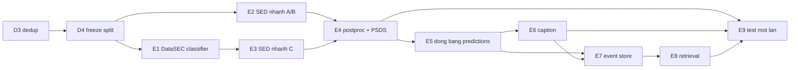

# PLAN.md — Master Plan 8 tuần

**Bắt đầu:** 22/09/2026 · **Deadline:** 09/11/2026 · **Buffer:** tới 16/11/2026

> Mỗi tuần chỉ hoàn tất khi đạt **Nghiệm thu** và cập nhật
> [STATUS.md](STATUS.md). "Code chạy" không phải nghiệm thu.

---

## Bảng trạng thái tổng

| Tuần | Ngày | Trọng tâm | Trạng thái |
|---|---|---|---|
| W1 | 22–28/09 | Cổng dữ liệu D1–D4 + tài liệu | ✅ |
| W2 | 29/09–05/10 | DataSEC classifier + PANNs | ✅ làm sớm |
| W3 | 06–12/10 | SED ba nhánh + post-processing | ✅ làm sớm |
| W4 | 13–19/10 | Event-based F1, PSDS, phân tích lỗi | ✅ |
| W5 | 20–26/10 | Grounded caption + metric hallucination | ✅ làm sớm (ADR-0022/0023) |
| W6 | 27/10–02/11 | Event store + RAG + retrieval benchmark | ✅ làm sớm (ADR-0027 duyệt 26/09; Alembic hoãn) |
| W7 | 03–09/11 | API + frontend + test một lần | ◐ làm sớm: 7.1–7.4 xong; 28/09 demo Compose chuyển riêng sang v2 theo ADR-0035, hệ thống chính thức vẫn v1; 7.5–7.7 làm 19/10–02/11, sau S8 |
| W8 | 10–16/11 | Buffer, chỉ dùng khi được gia hạn (viết báo cáo dời lên 19/10) | ○ |
| SED v2 | thêm 26/09 | Cải thiện model SED ([ADR-0030](decisions/ADR-0030-cai-thien-sed-v2.md)) + tài liệu cho paper | ✅ chốt 26/09 tối: v2 ensemble 3 seed được chọn, test micro 0.1476 / macro 0.1369 (v1 0.0941 / 0.0917); S9 đang chạy; S10 T0 bước 1–2 xong |
| Cải thiện cuối | 27/09–18/10 | RQ1-v2, Track 2 PretrainedSED, lớp hiếm, vòng chọn cuối ([ADR-0031](decisions/ADR-0031-lo-trinh-cai-thien-cuoi-va-dong-bang-model.md)) | ○ |
| Viết báo cáo | 19/10–09/11 | Luận văn + slide (ADR-0031 §7) | ○ |

**Nếu không dùng buffer, W7 là tuần cuối.** Mọi thứ phải xong trước 09/11. Từ 26/09 lịch đi theo
khối "Lộ trình tới hạn nộp" bên dưới: **mốc đóng băng model 18/10**.

---

## Đồ thị phụ thuộc


```mermaid
flowchart LR
    D3[D3 dedup] --> D4[D4 freeze split]
    D4 --> E1[E1 DataSEC classifier]
    D4 --> E2[E2 SED nhanh A/B]
    E1 --> E3[E3 SED nhanh C]
    E2 --> E4[E4 postproc + PSDS]
    E3 --> E4
    E4 --> E5[E5 dong bang predictions]
    E5 --> E6[E6 caption]
    E5 --> E7[E7 event store]
    E6 --> E7
    E7 --> E8[E8 retrieval]
    E4 --> E9[E9 test mot lan]
    E6 --> E9
    E8 --> E9
```

**Đường găng: D3 → D4 → E2 → E4 → E5 → E6 → E9.** Trễ bất kỳ mắt nào trên đường
này là trễ toàn bộ. E1/E3 (transfer) và E7/E8 (RAG) nằm ngoài đường găng nên là
ứng viên cắt đầu tiên.

---

# W1 · 22–28/09 · Cổng dữ liệu và tài liệu

**Mục tiêu:** mở cổng D4 để mọi thí nghiệm sau đó hợp lệ.

### Tasks

| # | Task | Ước lượng | Trạng thái |
|---:|---|---|---|
| 1.1 | Verify MD5 hai archive | 0.5 h | ✅ |
| 1.2 | Archive audit + xác minh taxonomy | 2 h | ✅ |
| 1.3 | Git init + baseline commit | 0.5 h | ✅ |
| 1.4 | Viết lại SYSTEM/taxonomy/DATA_PLAN/evaluation_protocol | 6 h | ✅ |
| 1.5 | CLAUDE.md + 5 ADR | 3 h | ✅ |
| 1.6 | PLAN + STATUS + docs còn lại | 2 h | ✅ |
| 1.7 | **`scripts.find_duplicates` (T1/T2/T3)** | 6 h | ✅ |
| 1.8 | **Chạy dedup, mở cổng D3** | 3 h | ✅ |
| 1.9 | Giải nén + inventory DataSEC (D1) | 2 h | ✅ |
| 1.10 | `scripts.check_leakage` + freeze split (D4) | 4 h | ✅ |
| 1.11 | JSON Schema contracts + test | 3 h | ✅ |
| 1.12 | CI baseline (ruff + pytest + guard api/torch) | 2 h | ✅ |

### Nghiệm thu W1

- [x] D1–D4 pass cho **cả hai** dataset
- [x] `duplicate_groups.csv` và `exclusions.csv` đã commit
- [x] Báo cáo dedup xuyên dataset trong `docs/measurements/dedup_20260923.md`
- [x] Split freeze (`datased_polyphonic.frozen.json`), SHA-256 `d2924a5e45c2b271…`, 5 kiểm leakage pass
- [x] Tag `data-v1.0` (`git tag -n`: "cổng dữ liệu D1–D4 đã đóng")
- [x] CI xanh trên GitHub Actions (`de4acc1`). Lần chạy đầu đỏ: kiểm đường dẫn tương đối
      trong manifest phụ thuộc hệ điều hành (`Path.is_absolute`) — đã sửa, có test cho cả hai quy ước.

> ⚠️ **Nếu D3 phát hiện trùng lặp > 5%**, RQ1 phải đổi cách diễn giải ngay tuần
> này, không để tới W3. Xem [DATA_PLAN §7.6](DATA_PLAN.md).

---

# W2 · 29/09–05/10 · DataSEC classifier và PANNs

### Tasks

| # | Task | Ước lượng |
|---:|---|---|
| 2.1 | Dataset loader DataSEC (22 coarse + 28 subclass) | 4 h |
| 2.2 | Class-balanced sampler + test | 3 h |
| 2.3 | Tích hợp PANNs CNN14, kiểm vừa 8 GB VRAM | 6 h |
| 2.4 | `logmel_panns_v1` theo cấu hình PANNs | 3 h |
| 2.5 | Train classifier coarse (E1) | 4 h |
| 2.6 | Thêm subclass head + consistency loss | 5 h |
| 2.7 | Calibration (ECE) + per-class table | 3 h |
| 2.8 | Ablation A6: balanced vs uniform sampling | 4 h |

### Nghiệm thu W2

- [x] Classifier coarse có macro-F1 + per-class table + run manifest hợp lệ (0.8467, D1/D3)
- [x] Subclass head báo **hai** con số macro-F1 theo [ADR-0006](decisions/ADR-0006-danh-gia-subclass.md) (0.6266 / 0.8453)
- [x] 4 subclass low-support báo bằng số tuyệt đối
- [x] PANNs chạy được trong 8 GB, ghi rõ batch size khả thi (24 @ 10 s)
- [x] A6 có kết quả, kết luận ghi vào ADR-0002 (giữ balanced)

---

# W3 · 06–12/10 · SED ba nhánh

**Tuần quan trọng nhất — nằm trên đường găng và chứa RQ1.**

### Tasks

| # | Task | Ước lượng |
|---:|---|---|
| 3.1 | Nhánh A: CNN+BiGRU scratch, split đã freeze | 4 h |
| 3.2 | Nhánh B: PANNs CNN14 → DataSED | 6 h |
| 3.3 | Nhánh C: PANNs → DataSEC → DataSED | 6 h |
| 3.4 | Lưu logit thô `predictions/{dev,test}.npz` | 3 h |
| 3.5 | Suy duration prior từ **train** | 3 h |
| 3.6 | Quét θ per-class trên **dev** | 4 h |
| 3.7 | Đóng băng `postproc.json` | 1 h |
| 3.8 | Ablation A2 (global vs per-class θ), A3 (median filter) | 4 h |

### Nghiệm thu W3

- [x] Ba nhánh cùng split, cùng budget, cùng seed set (B/C 5 seed; A 1 seed)
- [x] `postproc.json` đóng băng, hiệu chuẩn đúng nguồn ([ADR-0003](decisions/ADR-0003-threshold-va-post-processing.md))
- [x] Logit thô lưu được, quét lại θ không cần train lại
- [x] **Δ = C − B** tính được, kèm ghi chú kết quả D3 — âm tính, [ADR-0021](decisions/ADR-0021-rq1-ket-qua-am-tinh.md)

---

# W4 · 13–19/10 · Metric SED thật

### Tasks

| # | Task | Ước lượng |
|---:|---|---|
| 4.1 | Tích hợp `sed_eval`, event-based F1 (collar 0.2 s / 20%) | 4 h |
| 4.2 | Tích hợp `psds_eval`, hai scenario đóng băng | 5 h |
| 4.3 | Bootstrap CI theo **recording**, 1000 lần | 3 h |
| 4.4 | Phân tích lỗi: confusion, insertion/deletion/fragmentation/merging | 5 h |
| 4.5 | Hiệu năng theo duration / polyphony / confidence | 4 h |
| 4.6 | Cập nhật `confusable_with` từ ma trận nhầm thật — ✅ 26/09 ([taxonomy.md §8.1](taxonomy.md)) | 2 h |
| 4.7 | Ablation A4 (`pos_weight` trần) — ✅ 26/09 (ADR-0028) | 4 h |
| 4.8 | Chạy 3 seed cho cấu hình cuối | 6 h |
| 4.9 | Tối ưu không train lại (thêm 25/09, [ADR-0024](decisions/ADR-0024-toi-uu-sed-ensemble-va-chon-hau-xu-ly-tren-dev.md)): ensemble + chọn kiểu θ / percentile `g_max` bằng CV trên **dev**, chọn hệ thống theo luật ghi trước — ✅ 25/09 ([§5](decisions/ADR-0024-toi-uu-sed-ensemble-va-chon-hau-xu-ly-tren-dev.md)) | 6 h |

### Nghiệm thu W4

- [x] Event-based F1 và PSDS-1/PSDS-2 cho cả ba nhánh
- [x] CI bootstrap theo recording cho mọi số chính — từng run, và event-F1 trung bình nhiều run + hiệu số C − B (`rq1_multirun_bootstrap_clean_20260925.md`, ADR-0021 §6; PSDS không cộng dồn nên chỉ mean ± sd)
- [x] Bảng phân tích lỗi per-class (`branch_per_class_*`, `error_totals` trong `evaluation.json`)
- [x] [taxonomy.md §8](taxonomy.md) cập nhật bằng cặp nhầm thật, kèm số lượt — §8.1, dev, 7 run sạch (`confusable_pairs_clean_dev_20260925.md`)
- [x] Nếu không đủ ngân sách cho 3 seed: ghi rõ và **không** tuyên bố Δ nhỏ có ý nghĩa (5 seed, Welch t-test)

---

# SED v2 · thêm 26/09 · Cải thiện model ([ADR-0030](decisions/ADR-0030-cai-thien-sed-v2.md), duyệt 26/09)

Người dùng (26/09): event-F1 0.06–0.09 quá thấp. Đề tài tập trung vào model, nghiên cứu và tối
ưu, hướng tới paper → mọi kỹ thuật, nguồn và kết quả ghi vào [PAPER_NOTES.md](PAPER_NOTES.md)
và [RELATED_WORK.md](RELATED_WORK.md).

### Tasks

| # | Task | Trạng thái |
|---:|---|---|
| S0 | Chẩn đoán trần (độ phân giải, người), phân rã lỗi, onset/offset/segment — `report_sed_ceilings` | ✅ 26/09 |
| S1 | cSEBB (Ebbers 2024) + CV trên dev | ✅ 26/09 — âm tính trên v1 |
| S2 | Code v2: pool thời gian cấu hình được, GRU sau encoder, lr riêng, warmup + cosine, random crop, mixup, FilterAugment, factory model, `dump_predictions`, `evaluate_run --split dev` | ✅ 26/09 |
| S3 | Pilot lr encoder trên dev (3 epoch) | ✅ 26/09 — 3e-4 |
| S4 | Hàng đợi: v2 × 3 seed {20260922, 2, 3} + ablation (/64, trần 50, không augmentation) | ✅ 26/09 18:10 (6 run, tree sạch) |
| S5 | Chọn hậu xử lý (θ global × p, cSEBB) bằng CV dev cho từng run; ensemble 3 seed; bảng ablation dev | ✅ 26/09 tối (`8795960`; `sed_v2_ablation_20260926.md`) |
| S6 | Commit lựa chọn hệ thống (ADR-0030 §5) → `dump_predictions --split test` → `evaluate_run` một lần | ✅ lựa chọn `ec71b20` → test `43d5847`: v2 ensemble micro 0.1476, macro 0.1369 |
| S7 | Phân bố xác suất + sai số biên có artifact (v1 vs v2) + event-F1 macro | ✅ `boundary_errors_20260926`, `sed_ceilings_v2_20260926`, `event_f1_macro_20260926`; bootstrap ghép cặp v2 − v1 +0.0536 [+0.0261, +0.0853] |
| S8 | Chạy lại W5 e2e, W6 RQ3 trên event của hệ thống thắng vòng chọn cuối; đổi hệ thống phục vụ + parity 7.1. **Một lần, sau mốc 18/10** (ADR-0031 §6); không cần nếu ensemble C v1 thắng | ○ sau 18/10 |
| S9 | RQ1-v2: v2 khởi tạo DataSEC × 3 seed {20260922, 2, 3}; thiết kế và phân tích ghi trước (ADR-0031 §2). Train ngay sau S6; test chỉ sau khi vòng chọn cuối commit. Công cụ: `--evaluation-name`/`--postproc-name` + cột macro cho `report_rq1_multiseed`, `report_multirun_bootstrap` — ✅ 26/09. Script hàng đợi `s9_queue.sh` — ✅ 27/09 03:53: 3 run xong, tree sạch, code train trùng `e808df4`. Ensemble (d)/(e) + CV dev xong 04:42 (PAPER_NOTES S26–S27); **d có CV dev cao nhất trong mọi ứng viên non-Track2 tới nay** | ✅ train+CV dev xong; test 6 run chờ S13 |
| S10 | Track 2 PretrainedSED: T0 cổng khả thi (nguồn V3, license checkpoint, VRAM, 1 epoch dev hết đường ống) → ADR-0032 → 3 seed. Thứ tự đổi ở [ADR-0032](decisions/ADR-0032-track2-encoder-pretrain-theo-frame.md): **T2a BEATs strong đóng băng + head v2** trước, T2b `frame_mn10` fine-tune sau; ứng viên (f1)–(f4) ghi trước | ◐ T2a **xong 27/09** (T0, pilot lr=0.001, 3 seed, ensemble (f1)/(f3), CV dev — ADR-0032 §9: (f1) 0.2114±0.0491 gần bằng (c), dưới (d)); T2b **xong 28/09** (T0 đạt, pilot lr=3e-4, 3 seed, (f2) 0.2224 cSEBB / (f4) 0.2248 global, CV dev — ADR-0032 §11). S10 đóng; test chờ S13 |
| S11 | Lớp hiếm: loss focal hoặc asymmetric thay `pos_weight` trên họ model đang dẫn; ứng viên ghi trước run (ADR-0031 §5) | ○ sau Track 2, nếu còn thời gian |
| S12 | Seed thêm (2, 3) cho ablation có \|Δ\| trong 0.5–1.5 lần ngưỡng nhiễu (ADR-0031 §5) | ✅ không cần: tỷ lệ 1.6 (pool /64), 0.24 (trần 50), 0.13 (không augmentation) |
| S13 | Vòng chọn cuối tại mốc 18/10: CV dev micro trên tập `annotated`, commit trước test, test một lần mọi ứng viên mới và 6 run RQ1-v2 (ADR-0031 §4, sửa bởi ADR-0034 §2). Dữ liệu chuẩn bị đã đủ 18/18 file cho 9 ứng viên; bảng tạm thời `f2/f4/f1/d/e/c/f3/b/a`, nhưng **chưa chọn** và chưa mở test ([measurement](measurements/s13_ranking_annotated_20260928.md)) | ○ 18/10 |

### Nghiệm thu SED v2

- [x] Chẩn đoán có artifact trước khi đổi code (`sed_ceilings_20260926.md`)
- [x] Luật chọn ghi và commit trước khi có số v2 (`ead5a2f`)
- [x] Mọi run v2 trên tree sạch; ablation chỉ trên dev (6/6 `dirty=false`; `sed_v2_ablation_20260926.md`)
- [x] Lựa chọn hệ thống commit trước khi sinh logit test (`ec71b20`; test dump ở `43d5847`)
- [x] Test một lần; báo mọi cấu hình, kể cả khi v2 thua v1 (ADR-0030 §9: v2 thắng event-F1 nhưng **không** thắng PSDS)
- [x] PAPER_NOTES và RELATED_WORK cập nhật với mọi kết quả, kể cả âm tính (PAPER_NOTES S18–S25)

### Runbook sau hàng đợi (ADR-0030 §4–§5) — chạy đúng thứ tự

Viết sẵn 26/09 để khi hàng đợi xong chỉ việc chạy. `<…>` là run ID trong `v2_queue.log`.

```bash
# 0. Log ngầm: scratchpad phiên 9d87d957… (v2_queue.log, cv_follow.log, post_queue.log).
#    "FAILED rc=127" là giả — kiểm manifest.complete (TRAINING_OPS_PLAN §7 #6).

# 1. Ensemble chỉ-dev 3 seed bằng script repo + CV hai họ hậu xử lý
.venv/Scripts/python.exe -m scripts.build_ensemble --splits dev --label v2 ml/runs/<s20260922> ml/runs/<s2> ml/runs/<s3>
.venv/Scripts/python.exe -m scripts.select_postproc_cv ml/runs/<ens> --modes global --workers 6
.venv/Scripts/python.exe -m scripts.select_sebb_cv ml/runs/<ens> --workers 6

# 2. Measurement cho paper (chỉ dev)
.venv/Scripts/python.exe -m scripts.report_sed_v2_ablation --full ml/runs/<s20260922> ml/runs/<s2> ml/runs/<s3>     --ablation "không độ phân giải (pool /64)=ml/runs/<nores>" --ablation "trần pos_weight 50=ml/runs/<cap50>"     --ablation "không augmentation=ml/runs/<noaug>" --reference "ensemble C v1=ml/runs/sed_ensemble_C_clean_20260925T045631Z"
.venv/Scripts/python.exe -m scripts.report_boundary_errors --run "v1 ensemble C=ml/runs/sed_ensemble_C_clean_20260925T045631Z" --run "v2 ensemble=ml/runs/<ens>"
.venv/Scripts/python.exe -m scripts.report_sed_ceilings --run ml/runs/<ens>          # phân rã lỗi v2

# 3. Chọn hệ thống — COMMIT trước khi mở test
.venv/Scripts/python.exe -m scripts.select_sed_v2 --candidate "ensemble C v1=ml/runs/sed_ensemble_C_clean_20260925T045631Z"     --candidate "v2 run đơn=ml/runs/<s20260922>" --candidate "v2 ensemble 3 seed=ml/runs/<ens>"
git add docs/measurements/sed_v2_* docs/measurements/boundary_errors_* && git commit   # lựa chọn có trước test

# 4. Test MỘT lần cho ứng viên (b) và (c), báo tất cả (ADR-0030 §5)
.venv/Scripts/python.exe -m scripts.dump_predictions ml/runs/<s> --split test          # từng seed
.venv/Scripts/python.exe -m scripts.build_ensemble --splits dev test --label v2 <3 seed>   # dev.npz phải trùng SHA bản chỉ-dev
.venv/Scripts/python.exe -m scripts.evaluate_run ml/runs/<s20260922> --postproc ml/runs/<s20260922>/postproc_cv.json --tag cv
.venv/Scripts/python.exe -m scripts.evaluate_run ml/runs/<ens dev+test> --postproc ml/runs/<ens>/postproc_cv.json --tag cv
.venv/Scripts/python.exe -m scripts.report_test_ledger
.venv/Scripts/python.exe -m scripts.report_event_f1_macro                               # nợ #20

# 5. PAPER_NOTES §2/§9, ADR-0030 (kết quả), STATUS, CLAUDE. KHÔNG chạy S8 lúc này (ADR-0031 §6)

# 6. S9 — RQ1-v2 (ADR-0031 §2), ngay sau bước 4. Code train giữ nguyên tới khi 3 run xong
#    (kiểm git diff như ADR-0030 §8); code Track 2 chỉ vào master sau đó.
.venv/Scripts/python.exe -m scripts.train_sed --encoder panns --datasec-checkpoint ml/runs/classifier_datasec_20260923T121808Z/checkpoints/best.pt --recipe v2 --seed <s>   # s = 20260922, 2, 3; KHÔNG --evaluate-test
.venv/Scripts/python.exe -m scripts.select_postproc_cv ml/runs/<c-v2> --modes global --workers 6   # từng run
.venv/Scripts/python.exe -m scripts.select_sebb_cv ml/runs/<c-v2> --workers 6
.venv/Scripts/python.exe -m scripts.build_ensemble --splits dev --label c-v2 <3 run C-v2>          # ứng viên (d), rồi CV như bước 1
.venv/Scripts/python.exe -m scripts.build_ensemble --splits dev --label bc-v2 <3 B-v2> <3 C-v2>    # ứng viên (e), rồi CV như bước 1
#    Test của 6 run RQ1-v2 chỉ chạy SAU khi vòng chọn cuối (S13) đã commit:
.venv/Scripts/python.exe -m scripts.dump_predictions ml/runs/<c-v2> --split test                  # 3 run C-v2
.venv/Scripts/python.exe -m scripts.evaluate_run ml/runs/<run> --postproc ml/runs/<run>/postproc_cv.json --tag cv   # 6 run, mỗi run một lần
.venv/Scripts/python.exe -m scripts.report_rq1_multiseed --branch-b <3 B-v2> --branch-c <3 C-v2> --evaluation-name evaluation_cv.json --output docs/measurements/rq1_v2_multiseed_<ngày>.md
.venv/Scripts/python.exe -m scripts.report_multirun_bootstrap --branch B <3 B-v2> --branch C <3 C-v2> --postproc-name postproc_cv.json --evaluation-name evaluation_cv.json --tag v2
```

Lưu ý: nếu ứng viên thắng dùng họ **cSEBB**, `evaluate_run` và phục vụ chưa hỗ trợ cSEBB →
phải cài trước bước 4 (hiện cSEBB thua ở v1 và v2 seed 1).

---

# Lộ trình tới hạn nộp · duyệt 26/09 ([ADR-0031](decisions/ADR-0031-lo-trinh-cai-thien-cuoi-va-dong-bang-model.md))

Người dùng (26/09): "làm theo những gì bạn cho là nên làm, nên duyệt, ghi vào kế hoạch"; mục tiêu
**ưu tiên cải thiện kết quả**. Hôm nay mới là W1 theo lịch gốc, nhưng W1–W6 đã xong sớm; phần dư
dùng cho cải thiện model, rồi viết báo cáo trước hạn.

| Thời gian | Việc |
|---|---|
| 26–27/09 | Chốt v2 theo Runbook (S5–S7); S9 train qua đêm |
| 28/09–18/10 | Track 2 (S10), lớp hiếm (S11), seed thêm cho ablation (S12) |
| **18/10** | **Mốc đóng băng model**: vòng chọn cuối (S13), commit, rồi test một lần |
| 19/10–02/11 | S8 một lần; đóng W7 (7.4–7.7); bộ lọc từ câu hỏi (L2); viết báo cáo (L3) |
| 03–09/11 | Hoàn thiện báo cáo và slide (L4) |
| 10–16/11 | Buffer W8, chỉ khi được gia hạn |

**Luật của giai đoạn này:**

- Con số chính là event-F1 **macro**, micro báo kèm; mọi vòng chọn hệ thống vẫn dùng **micro**
  (ADR-0031 §1).
- Sau mốc 18/10 không thêm thí nghiệm model. S8 chạy đúng một lần trên hệ thống thắng.
- Code train đóng băng trong lúc S9 chạy (RQ1-v2 cần cùng code với B-v2). Code Track 2 phát
  triển trong worktree, chỉ vào master sau khi S9 xong.
- Ứng viên nào cũng ghi vào ADR-0031 §4 hoặc ADR-0032 **trước** khi có CV dev của nó.

### Tasks ngoài khối SED v2

| # | Task | Khi nào | Trạng thái |
|---:|---|---|---|
| L1 | Push nhánh phụ `wip/sed-v2` (sao lưu commit + chạy CI); master trên remote chỉ nhận tuần đã xong | 26/09 | ◐ push tới `bbae05b` (27/09, người dùng cho phép); commit Track 2a sau đó chưa push |
| L2 | ~~Chuyển câu hỏi tự nhiên thành bộ lọc: Qwen + grammar như ADR-0023, ADR riêng; đo độ chính xác parse trên query set v2, rồi RQ3 với bộ lọc parse được~~ — **xong sớm 28/09** (ADR-0036): exact template 0.855, paraphrase 0.925; RQ3 validation hybrid Δ gold +0.012 EN / −0.002 VI. Giả định “số sẽ thấp đi” không đúng cho mọi ô: filter sai có thể tình cờ đổi thứ hạng có lợi, không được diễn giải là cải thiện | 19/10–02/11 | ✅ 28/09 |
| L3 | Viết báo cáo luận văn (khung: SYSTEM.md; số: measurements; dẫn chứng: PAPER_NOTES) | 19/10–09/11 | ○ |
| L4 | Slide bảo vệ | 03–09/11 | ○ |
| L5 | Xem lại cụm từ tiếng Việt (ADR-0025, đang duyệt tạm) | Khi hoàn thiện giao diện | ○ |
| L6 | Ưu tiên thấp nhất: mở rộng mẫu người cho metric C2 (chỉ nếu paper theo hướng C); xác thực cho demo | Nếu còn thời gian | ○ |

---

# W5 · 20–26/10 · Grounded caption

### Tasks

| # | Task | Ước lượng |
|---:|---|---|
| 5.1 | **E5: đóng băng SED predictions** | 2 h |
| 5.2 | Timeline canonicalizer + contract test | 4 h |
| 5.3 | Caption lexicon 22 lớp + lexicon cấm (G3) | 5 h |
| 5.4 | Template captioner (baseline) | 4 h |
| 5.5 | Bộ metric hallucination (C2) | 6 h |
| 5.6 | Nhánh unconstrained (đối chứng) | 5 h |
| 5.7 | Nhánh constrained | 8 h |
| 5.8 | Đánh giá oracle + end-to-end | 4 h |

### Nghiệm thu W5

- [x] Ba ràng buộc G1/G2/G3 có **test tự động**, không kiểm bằng mắt
- [x] Template captioner đạt hallucination = 0 (xác nhận harness đúng)
- [x] Báo **cả** oracle và end-to-end (`caption_grounding_*_test.md`)
- [x] Ba nhánh chạy trên **cùng** SED prediction đóng băng (script kiểm timeline trùng khít)
- [x] Caption lớp gộp nêu đúng mức không chắc chắn ([taxonomy.md §7](taxonomy.md)) — template/constrained 0 vi phạm, unconstrained 11/18 và 22/39 (ADR-0023 §5)
- [x] Caption tiếng Việt cho giao diện (ADR-0004; HANDOFF §A2 — rà trước khi push, 25/09): template VI + lexicon VI riêng, mọi lớp có cụm EN và VI, 0 vi phạm G1–G3 trên timeline thật ([ADR-0025](decisions/ADR-0025-caption-tieng-viet.md)) — **cụm từ VI chờ người dùng duyệt**
- [x] N-gram BLEU-4/CIDEr báo **để tham khảo** (evaluation_protocol §8.3; ADR-0023 §6)
- [x] Rà W5 phản biện (26/09): RQ2 có CI + hiệu số cặp (Q3/Q5); sửa caption constrained bị cắt (ADR-0023 §7); nhánh cover (ADR-0026); e2e trên SED tối ưu; lỗi theo lớp; kiểm lexicon bằng người (ADR-0022 §6)

---

# W6 · 27/10–02/11 · Event store và RAG

### Tasks

| # | Task | Ước lượng |
|---:|---|---|
| 6.1 | PostgreSQL + pgvector, schema + Alembic | 5 h |
| 6.2 | Nạp recordings/events/captions/caption_evidence | 4 h |
| 6.3 | Document builder (caption + event summary) | 3 h |
| 6.4 | Index BGE-M3 | 4 h |
| 6.5 | Structured filter + 4 temporal predicate | 5 h |
| 6.6 | Hybrid retriever | 4 h |
| 6.7 | Query set 100 câu + relevance tự động | 5 h |
| 6.8 | Answer generator có ràng buộc evidence | 5 h |
| 6.9 | Benchmark 3 cấu hình | 3 h |

### Nghiệm thu W6

- [x] 4 temporal predicate chạy bằng SQL, có test (SQLite + tích hợp PostgreSQL: SQL == ngữ nghĩa Python, 100 câu × 2 corpus)
- [x] `filter exactness` = **1.000** cho `hybrid` và `structured_only` (dev và test, ADR-0027 §8)
- [x] Query set xây **trước** khi xem kết quả (v2 đóng băng ở `4762f7f`, chọn theo train)
- [x] `unsupported-claim rate` = 0.000 (6.8: bộ sinh tất định + bộ kiểm độc lập, dev và test — ADR-0027 §8)
- [x] Bảng so sánh 3 cấu hình đầy đủ (EN + VI, CI, hiệu số cặp — ADR-0027 §8)

---

# W7 · 03–09/11 · Ứng dụng và test một lần

### Tasks

| # | Task | Ước lượng |
|---:|---|---|
| 7.1 | `services/inference`: preprocessing + SED + postproc + caption — ✅ 26/09 (parity 142 recording, ADR-0029 §7) | 6 h |
| 7.2 | `services/api`: upload, persistence, query (**không import torch**) — ✅ 26/09 | 6 h |
| 7.3 | Frontend: upload, timeline, caption, search, evidence — ✅ 26/09 | 8 h |
| 7.4 | Docker Compose đầu-cuối — ✅ 27/09 (ADR-0033), cập nhật 28/09 (ADR-0035): profile `app` demo v2 `150934Z`, mặc định code và hệ thống chính thức vẫn v1. Compose healthy; status `official=false`; parity v2 CUDA/CPU đều 425/425 event trong collar; E2E TRAIN có timeline + caption EN/VI + RAG ([demo_v2_e2e_20260928.md](measurements/demo_v2_e2e_20260928.md)) | 4 h |
| 7.5 | **E9: chạy test một lần, config đóng băng** — sau S8, trên hệ thống SED cuối (ADR-0031 §7) | 4 h |
| 7.6 | Sinh toàn bộ measurement, cập nhật STATUS | 3 h |
| 7.7 | Đóng băng artifact, hướng dẫn tái lập | 3 h |

### Nghiệm thu W7

- [x] Demo đầu-cuối: upload → timeline → caption → truy vấn có evidence (chạy thật qua `serve_demo` và qua compose, 26/09)
- [ ] CI xanh, guard `api` không import torch pass
- [ ] Test chạy **một lần**, mọi cấu hình đã chạy đều được báo cáo
- [ ] Mọi số trong báo cáo truy được về run manifest + split hash + taxonomy hash

---

# W8 · 10–16/11 · Buffer

Chỉ dùng nếu được gia hạn. Việc viết báo cáo **đã dời lên 19/10–09/11** (ADR-0031 §7), không chờ
W8. Nếu dùng W8, ưu tiên: vá lỗ hổng nghiệm thu → hoàn thiện `RELATED_WORK.md` → làm đẹp giao diện.

---

## Cut-list — thứ tự hy sinh khi trễ

Cắt từ trên xuống. Không cắt nhảy cóc.

| # | Cắt gì | Mất gì | Vì sao cắt được |
|---:|---|---|---|
| 1 | Giao diện đẹp, animation | Điểm trình bày | Không ảnh hưởng kết quả khoa học |
| 2 | `services/stream` | Demo streaming | Đã ngoài phạm vi MVP |
| 3 | Ablation A4 (`pos_weight`) | Một bảng ablation | Không trả lời RQ nào |
| 4 | 3 seed → 1 seed | Khoảng tin cậy | **Phải ghi rõ và không tuyên bố Δ nhỏ có ý nghĩa** |
| 5 | Nhánh A (scratch) | Baseline dưới | RQ1 chỉ cần B và C |
| 6 | Nhánh constrained captioner | Một nửa RQ2 | Template vs unconstrained vẫn trả lời được một phần |
| 7 | Subclass head (RQ4) | RQ4 | Đóng góp phụ, không phải C1/C2/C3 |
| 8 | Frontend, chỉ giữ API | Demo trực quan | Kết quả khoa học không đổi |
| 9 | RAG answer generation, chỉ giữ retrieval | Một phần C4 | Retrieval metric vẫn trả lời RQ3 |

### Không bao giờ cắt

- Cổng D3/D4 và audit leakage — cắt là mọi kết quả mất giá trị
- Event-based F1 và PSDS — không có thì không có kết luận SED nào
- Bộ metric hallucination — là đóng góp C2
- Giao thức test một lần

---

## Nợ kỹ thuật và việc phải xác minh

| # | Hạng mục | Mức | Hạn |
|---:|---|---|---|
| ~~1~~ | ~~`git.revision` của baseline là `"HEAD"`, `dirty: true`~~ — **đóng 24/09**: nhánh A SED (`sed_polyphonic_20260923T173234Z`) và D1 classifier chạy trên tree sạch, `git.revision` là hash thật, `dirty=false` | — | ✅ |
| ~~2~~ | ~~`find_duplicates` và `check_leakage` chưa có~~ — **đóng 23/09** | — | ✅ |
| ~~3~~ | ~~Chưa lưu logit thô~~ — **đóng 23/09** (G2): `predictions/{dev,test}.npz` mọi run SED | — | ✅ |
| ~~4~~ | ~~Manifest thiếu `data_manifest_sha256` và `postproc`~~ — **đóng 23/09** (G2/H2): `data_manifest_sha256` trong `manifest.json`, `postproc.json` schema riêng (`contracts/postproc.schema.json`) | — | ✅ |
| 5 | Seed reproducibility: classifier **tái lập bit-for-bit** (D2). **SED KHÔNG tái lập** cùng seed (24/09): code train không đổi, frame macro-F1 B 0.5850→0.5705, C 0.5947→0.5893. Nguyên nhân chưa xác minh. Hệ quả: mọi số SED phải báo mean±sd nhiều run, không báo 1 run | **CAO** | W3 |
| 6 | `RELATED_WORK.md` còn `⚠️ CẦN XÁC MINH`, chưa có DOI | TRUNG BÌNH | W8 |
| ~~7~~ | ~~Ngưỡng T3 0.95/0.85 chưa hiệu chuẩn~~ — **đóng 23/09**: giữ 0.95/0.85, `threshold_calibration.json` | — | ✅ |
| ~~8~~ | ~~Percentile `g_max` chọn không có cơ sở thực nghiệm~~ — **đóng 25/09** (4.9, ADR-0024): CV 5 fold trên **dev** chọn percentile 25 ở cả 5 ứng viên (cùng hướng A5 đã thấy trên test); ADR-0003 giữ percentile 50 cho số RQ1 | — | ✅ |
| 11 | `short_duplicate_min = 0.99` chọn từ hình dạng phân bố, chưa hiệu chuẩn trên positive đoạn ngắn | TRUNG BÌNH | W2 |
| ~~12~~ | ~~1,731 ràng buộc cohesion kéo theo cụm lớn~~ — **đóng 23/09**: DataSED cụm lớn nhất 4 (0.6%); DataSEC có cụm 326 (6.5%), cần theo dõi ở W2 | THẤP | ✅ |
| ~~13~~ | ~~35 cặp xuyên dataset ở dải review chưa có quyết định người~~ — **đóng 23/09**: duyệt tay xong (10 duplicate/1 unsure/24 distinct) | — | ✅ |
| ~~9~~ | ~~Chưa có CI~~ — **đóng 24/09**: `.github/workflows/ci.yml` xanh trên GitHub Actions | — | ✅ |
| ~~10~~ | ~~`contracts/*.schema.json` chưa tồn tại~~ — **đóng 23/09**: 8 schema Draft 2020-12 trong `contracts/` | — | ✅ |
| ~~14~~ | ~~RQ1 chưa đủ run để kết luận~~ — **đóng 24/09** (K1–K5, ADR-0021): 5 run/nhánh, chính 7 run sạch p=0.234/0.913/0.181, độ nhạy 10 run p=0.124/0.313/0.772 (số tính lại 25/09 sau `7ada7d7`) → RQ1 âm tính, báo cáo như vậy | — | ✅ |
| ~~15~~ | ~~RQ1 chưa khoá chính thức~~ — **đóng 24/09** (I8): B/C chạy lại trên tree sạch `5bf1cf7`, `rq1_delta_official_20260924.md` | — | ✅ |
| ~~16~~ | ~~`query_set.py` dùng lớp `car`, `dog` không có trong taxonomy → lọc rỗng im lặng~~ — **đóng 25/09**: lớp lấy từ `taxonomy.polyphonic_class_ids`, `validate_query_classes` từ chối lớp lạ | — | ✅ |
| ~~17~~ | ~~Relevance lấy từ chính bộ lọc đang đánh giá (`source: temporal_filter`)~~ — **đóng 25/09**: `ml/retrieval/relevance.py` tính từ annotation ground truth, cùng ngữ nghĩa với SQL (test chạy SQL trên SQLite); contract đổi sang `source: ground_truth` | — | ✅ |
| ~~18~~ | ~~Query set chỉ có câu temporal, 25/100 câu có relevant trên test~~ — **đóng 26/09** (6.7, ADR-0027): query set v2 4 nhóm 21/27/30/22, EN + VI, chọn theo ground truth **train**; 97/100 câu có relevant trên test, 96/100 dev (`retrieval_queryset_v2_20260925.md`) | — | ✅ |
| ~~19~~ | ~~Test tích hợp PostgreSQL treo ~130 s khi Docker tắt~~ — **đóng 26/09** (`550daec`): `connect_timeout` 5 s (`DB_CONNECT_TIMEOUT`); bộ test 13.5 phút → 57 s | — | ✅ |
| ~~20~~ | ~~Event-F1 headline là micro trong khi Q2 đòi macro~~ — **đóng 26/09 tối**: macro có cho mọi lần đánh giá, kể cả v2 (`event_f1_macro_20260926`); người dùng chốt macro là con số chính, chọn vẫn bằng micro (ADR-0031 §1) | — | ✅ |
| ~~21~~ | ~~Số văn liệu mức V2 phải đọc trực tiếp~~ — **đóng 27/09 đêm**: PretrainedSED V3 (26/09), DCASE 2016 T3 V3 (mọi số V2 khớp), bài DataSED V3 — đọc toàn văn lộ ra nguồn một phần từ AudioSet/Freesound có trộn tay (PAPER_NOTES S31) và dẫn tới nợ #25 | — | ✅ |
| ~~22~~ | ~~Bão hoà posterior mới là quan sát~~ — **đóng 26/09**: `boundary_errors_20260926.md` đo trên dev → **bác bỏ** (không bão hoà; biên lệch đối xứng) | — | ✅ |
| 23 | Mã thoát 127 của mọi run v2 (cuDNN giải phóng GRU nhiều lớp có dropout lúc tắt, Windows) — tự động hoá phải kiểm `manifest.complete` (TRAINING_OPS_PLAN §7 #6) | THẤP | Ghi nhận |
| ~~24~~ | ~~`metrics.json` `best_validation` luôn là max frame macro-F1, kể cả khi checkpoint chọn theo macro-AP (v2)~~ — **đóng 27/09** (`4135d17`): dùng đúng `config.select_metric`; v1 không đổi hành vi | — | ✅ |
| ~~25~~ | **Đóng 28/09: phương án (B), [ADR-0034](decisions/ADR-0034-chi-cham-recording-co-ground-truth-polyphonic.md)** — `--eval-set annotated`; không đổi raw annotation, split hay train. Đã sinh đủ 18/18 file CV dev annotated sạch cho 9 ứng viên và báo cáo tự động [s13_ranking_annotated_20260928.md](measurements/s13_ranking_annotated_20260928.md). Thứ hạng đổi từ `f4/d/f2/c/f1/e/b/f3/a` (`all`) thành `f2/f4/f1/d/e/c/f3/b/a` (`annotated`); f2 0.2383 ± 0.0562 và f4 0.2354 ± 0.0585, chênh 0.0029 ≤ sd f2 nên không gọi là tốt hơn. Đây chỉ là dữ liệu chuẩn bị cho S13, chưa chọn hệ thống và chưa mở test. Gốc nợ: 14 recording S-0704…S-0717 không có GT polyphonic (train 8 / dev 3 / test 3), xem [polyphonic_coverage_20260927.md](measurements/polyphonic_coverage_20260927.md). | — | ✅ |

---

## Runbook đêm 27→28/09 — bàn giao cho phiên tự động

Người dùng (27/09 22:40): tạm dừng "Cải thiện cuối" ở S10/T2a để hoàn thiện demo (W7 7.4); sau đó
uỷ quyền chạy tự động hoàn toàn qua đêm. Thứ tự ưu tiên **cố định, không đảo**:

### P1 — Hoàn thành W7 7.4 (container hoá inference, ADR-0033) — ✅ XONG 27/09 23:50 (ADR-0033 §6)

Code đã viết xong, **chưa chạy build lần nào** (`b7c97d4`, đã push `wip/sed-v2`). Trạng thái lúc
dừng: Docker Desktop vừa khởi động xong (`docker info` trả về server 29.3.1), đĩa D **7.9 GB
trống** — theo dõi sát, dừng ngay nếu xuống dưới ~2 GB thay vì cố chạy tiếp.

1. `docker compose --profile app build inference api` — theo dõi `df -h /d` trong lúc build (kéo
   torch CPU + base image). Nếu lỗi thiếu gói, sửa `requirements-inference.txt` (đối chiếu grep
   import như ADR-0033 §3 đã làm, không đoán).
2. `docker compose --profile app up -d --wait` — chờ cả `db`, `inference`, `api` healthy.
   `inference` không publish port ra host; kiểm bằng
   `docker compose exec inference curl -f http://localhost:8001/health`, hoặc thêm tạm
   `ports: ["8001:8001"]` vào compose để debug từ host rồi bỏ lại nếu không cần cho demo cuối.
3. Test end-to-end thật: đọc `SYSTEM.md §4.4` cho đúng endpoint `api` (`/api/v1/...`), upload một
   file WAV thật (ví dụ một file trong `data/raw/datased/extracted`, đã mount read-only vào
   container `api`) qua `curl` tới `http://localhost:8088`, xem có ra timeline + caption +
   document như phục vụ trên host trước đây (`inference_parity_20260925.md`) không.
4. Đo parity CPU (ADR-0033 ghi rõ đây là hạn chế chưa đo): chạy
   `.venv/Scripts/python.exe -m scripts.check_inference_parity --device cpu` **trên host** (không
   cần qua Docker) để có số so với CUDA đã đo ở ADR-0029 §7. Ghi
   `docs/measurements/inference_parity_cpu_<ngày>.md`, dẫn vào ADR-0033.
5. Cập nhật `PLAN.md` W7 7.4 → ✅ kèm bằng chứng, `STATUS.md`, `CLAUDE.md` §3/§10. Gate
   (`ruff` + `pytest`) trước khi commit. Không push (để người dùng tự chạy khi rảnh, như thường
   lệ — quyền push của agent bị chặn ngoài phiên có người xác nhận trực tiếp).
6. Nếu build/parity lộ ra lỗi thật trong `services/inference` hay `ml/inference` (không phải lỗi
   hạ tầng Docker) — sửa, viết test khoá lại, đúng kỷ luật thường lệ của dự án.

**Không làm ở P1:** không đổi hệ thống SED đang phục vụ (`sed_ensemble_C_clean_20260925T045631Z`,
ADR-0029 §1) — việc đó chỉ đổi một lần ở S8, sau mốc 18/10.

### P2 — Chỉ khi P1 xong hoàn toàn và còn thời gian: T2b (`frame_mn10`) — ✅ XONG 28/09 03:56 (ADR-0032 §11)

Track 2b **chưa bắt đầu gì** — chưa tải checkpoint, chưa viết wrapper. Làm đúng theo khuôn T2a
(ADR-0032 §2-§4, §7-§8), nhưng **đây là fine-tune toàn bộ, không đóng băng** — hồ sơ VRAM khác
hẳn, không được giả định giống T2a.

1. Tải `frame_mn10_strong_1.pt` từ `https://github.com/fschmid56/PretrainedSED/releases/download/v0.0.1/frame_mn10_strong_1.pt`
   vào `artifacts/checkpoints/`, ghi SHA-256 + kích thước vào ADR-0032 (đối chiếu với API GitHub
   release, như đã làm với BEATs — dùng `curl -s https://api.github.com/repos/fschmid56/PretrainedSED/releases/tags/v0.0.1`,
   để ý rate-limit ẩn danh 60 request/giờ).
2. Đọc trực tiếp mã nguồn `models/frame_mn/{model.py,block_types.py,utils.py,Frame_MN_wrapper.py}`
   tại commit đã ghim `1aa47e482f7e89904cba2338999345025d8b4e36` — xác định đúng độ phân giải thời
   gian gốc của frame_mn (bảng trong bài không liệt kê S cho frame_mn, phải đọc code) trước khi
   quyết định cách đưa logit lên lưới 10 ms.
3. Vendor tối thiểu vào `ml/models/external/frame_mn/` — same kỷ luật NOTICE.md (SHA-256 file
   gốc, license EfficientAT MIT, danh sách chỗ sửa) như `ml/models/external/beats/`.
4. `ml/models/frame_mn_finetune.py`: theo ADR-0032 §3 — thay lớp 447 bằng 21, **không** thêm
   sequence model (kiểu student trong bài, khác T2a). Nối vào `train_sed.py` qua
   `--encoder frame_mn --recipe t2b`, tương tự nhánh `beats`/`t2a` nhưng **không** cần
   `EncodedLoader` (không đóng băng, cả mạng train chung một lượt như `panns`/v2).
5. **Cổng T0 riêng cho T2b** (ADR-0032 §4): đo VRAM thật ở vài batch size (đừng giả định batch 24
   như T2a) — full fine-tune một CNN thật tốn hơn frozen-encoder-forward nhiều; 1 epoch dev hết
   đường ống, `dump_predictions --verify-dev` trùng bit. Ghi
   `docs/measurements/track2_t0_frame_mn_<ngày>.md`. Nếu không vừa 8 GB ở batch hợp lý, giảm
   batch, ghi vào ADR, không âm thầm đổi kiến trúc.
6. Pilot lr (ghi luật **trước** khi chạy, dùng `scripts.report_pilot_lr` đã có, đã sửa lỗi
   encoding cp1252): ứng viên {1e-4, 3e-4, 1e-3} theo ADR-0032 §3.
7. 3 seed chính thức {20260922, 2, 3} → CV mỗi seed (`select_postproc_cv --modes global`,
   `select_sebb_cv`) → ensemble (f2) T2b×3 và (f4) T2b+B-v2 6-model → CV cho cả hai. **Không mở
   test** cho bất kỳ run/ensemble nào (ADR-0031 §4, chờ S13 18/10).
8. Ghi ADR-0032 §10 (kết quả T2b), PAPER_NOTES (S3x mới), CLAUDE.md, PLAN.md, STATUS.md — đúng
   mẫu đã làm cho T2a.

**Bài học đêm 27/09 phải áp dụng cho mọi script hàng đợi mới:**
- Mọi script Python mới in tiếng Việt ra stdout phải có
  `sys.stdout.reconfigure(encoding="utf-8", errors="replace")` **đầu `main()`** — console
  Windows mặc định cp1252, vỡ `UnicodeEncodeError` giữa chừng và làm hỏng biến đọc từ stdout của
  script gọi nó.
- Trong script bash hàng đợi: bắt `rc=$?` **ngay dòng sau** lệnh cần đo, không để lệnh nào (kể cả
  `$(date …)`) xen giữa — `$(...)` chạy subshell và ghi đè `$?` trước khi được đọc.
- `exit` bên trong một hàm bash được gọi qua `run=$(ham ...)` chỉ thoát **subshell của phép thế
  lệnh**, không dừng được vòng lặp cha — kiểm kết quả rỗng ở nơi gọi (`if [ -z "$run" ]; then
  exit; fi`) thay vì trông cậy `exit` trong hàm.
- Trước khi tin một hàng đợi tự động đã chạy đúng, đọc trực tiếp file kết quả (`.json`) chứ đừng
  chỉ tin log/biến shell đã truyền qua nhiều lớp.

### P3 — Nếu còn thời gian sau P1 và P2: nợ kỹ thuật #21 — ✅ XONG 28/09 00:00 (làm song song lúc GPU train; lộ ra nợ #25)

Đọc trực tiếp DCASE 2016 Task 3 và bài công bố DataSED (hiện V2, qua tóm tắt) trước khi viết
Chương 2 — nâng lên V3 trong `RELATED_WORK.md` §2.1, đúng kỷ luật đã áp dụng cho PretrainedSED.

### Ranh giới cứng — không được vượt dù tự động hoàn toàn

- **Không mở test** cho bất kỳ ứng viên nào (RQ1-v2, (d), (e), T2a, T2b) trước khi vòng chọn cuối
  S13 (18/10) đã commit trên dev. Đây là luật đã ghi trước ở ADR-0031 §4, không phải tuỳ chọn.
- **Dòng bàn giao 27/09 này đã được thay thế có chủ đích ngày 28/09 bởi ADR-0035:** profile demo
  được dùng v2 ngay, nhưng hệ thống **chính thức** vẫn là v1 và chỉ đổi một lần ở S8.
- **Không push** — quyền push của agent bị chặn ngoài phiên có người xác nhận trực tiếp; cứ
  commit đầy đủ, để người dùng tự push khi quay lại.
- Theo dõi đĩa (`df -h /d`) và RAM trước mỗi bước tốn tài nguyên (build Docker, tải checkpoint,
  train). Đĩa D chỉ còn ~7.9 GB lúc bàn giao — dừng và báo cáo thay vì cố chạy tiếp nếu xuống
  dưới ~2 GB.
- Nếu bất kỳ hàng đợi nào lỗi theo cách không hiểu được nguyên nhân trong vài lần thử — dừng lại,
  ghi rõ vào CLAUDE.md §10, không lặp lại vô hạn.

---

## Nhịp làm việc hằng tuần

| Khi nào | Làm gì |
|---|---|
| Đầu tuần | Đọc [CLAUDE.md](../CLAUDE.md) §3 → PLAN tuần hiện tại → chọn task |
| Mỗi block | Cập nhật CLAUDE.md §3, thêm dòng §10 |
| Có số mới | Sinh measurement **bằng script**, cập nhật STATUS.md |
| Có quyết định kiến trúc | Viết ADR |
| Cuối tuần | Đối chiếu nghiệm thu; chưa đạt thì hoặc kéo dài hoặc dùng cut-list |
