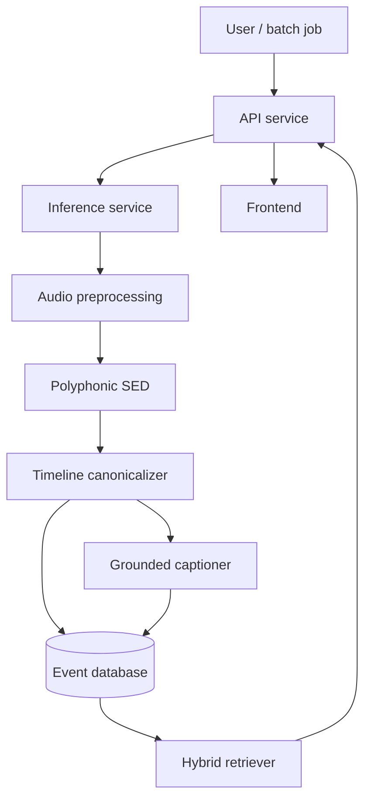
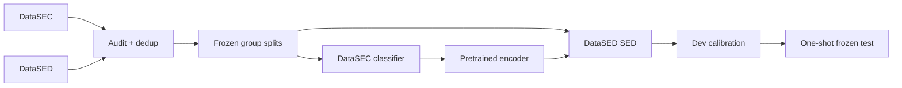

# SYSTEM.md — Đặc tả hệ thống

> Tài liệu này mô tả kiến trúc đích. `STATUS.md` mới là nguồn chân lý về phần đã chạy được.

## 1. Phạm vi

### 1.1 Input

- WAV hoặc audio chuyển đổi được sang WAV.
- Recording môi trường có thể chứa nhiều event chồng lấp.
- Batch offline là bắt buộc; stream gần thời gian thực là mở rộng.

### 1.2 Output

- Event class, onset, offset, confidence.
- Coarse class bắt buộc; subclass chỉ khi model hỗ trợ và phải ghi nguồn dự đoán.
- Caption được tạo từ event timeline.
- Event record có thể tìm theo metadata và ngữ nghĩa.
- Câu trả lời RAG kèm recording ID và time span làm bằng chứng.

### 1.3 Ngoài phạm vi

- Speech recognition, speaker identity hoặc nội dung hội thoại.
- Suy luận tội phạm, ý định, tai nạn hay tình trạng khẩn cấp.
- Tuyên bố triển khai trong trường học hoặc hệ thống an ninh thực tế.
- Sinh caption tự do không bị ràng buộc bởi event evidence.

## 2. Yêu cầu chức năng

| ID | Yêu cầu |
|---|---|
| F1 | Ingest file và chuẩn hóa audio theo config có version. |
| F2 | Phát hiện nhiều event chồng lấp cùng onset/offset. |
| F3 | Lưu raw label, canonical label và taxonomy version. |
| F4 | Sinh caption chỉ từ timeline đầu vào. |
| F5 | Lưu recording, event, caption, model version và provenance. |
| F6 | Truy vấn theo class, duration, time relation và semantic text. |
| F7 | Trả bằng chứng tới recording/time span. |
| F8 | Xuất metric và run manifest tái lập được. |

## 3. Thành phần



### 3.1 `ml/`

- `datasets/`: DataSEC/DataSED parsing và sample construction.
- `features/`: waveform, log-mel hoặc encoder preprocessing.
- `models/`: classifier, SED, hierarchical refinement.
- `training/`: loops, loss, checkpoint selection.
- `evaluation/`: classification, SED, caption và retrieval metrics.
- `captioning/`: timeline normalization, templates, constrained decoding.
- `retrieval/`: document construction, indexing và scoring.
- `configs/`: taxonomy, datasets, splits, model và experiment config.

### 3.2 `services/inference`

Chịu trách nhiệm load model, preprocessing, SED, post-processing và caption. Service trả object theo contract; không ghi trực tiếp database.

### 3.3 `services/api`

Chịu trách nhiệm upload, validation, persistence, retrieval orchestration và response. Không import PyTorch hoặc load checkpoint.

### 3.4 `services/frontend`

Hiển thị upload, waveform/timeline, caption, search results, evidence và model provenance.

### 3.5 `services/stream`

Mở rộng sau batch MVP: chunking, overlap-add, event stitching và backpressure. Không nằm trong critical path của benchmark.

## 4. Data flow huấn luyện



## 5. Taxonomy và output heads

- Classification chính: 22 coarse class DataSEC.
- SED chính: 21 polyphonic class DataSED; `wind_turbine` không thuộc polyphonic label set.
- SED phụ: 22 monophonic class.
- Subclass head: chỉ đánh giá trên DataSEC khi không có continuous subclass ground truth.
- `background`, `unknown` và `silence` là trạng thái, không phải event head mặc định.

Class order chỉ được định nghĩa trong config taxonomy có version. Checkpoint phải lưu taxonomy hash.

## 6. Grounded caption contract

Captioner nhận danh sách event sau post-processing:

```json
{
  "recording_id": "S-0001",
  "events": [
    {"class_id": "voices", "onset_s": 1.2, "offset_s": 4.8, "score": 0.91},
    {"class_id": "glass_breaking", "onset_s": 5.4, "offset_s": 6.1, "score": 0.84}
  ]
}
```

Captioner không được thêm location, cause, intent hoặc event không có trong input. Mỗi event mention phải truy ngược tới một hoặc nhiều event ID.

## 7. Retrieval

### 7.1 Structured retrieval

Áp dụng trước cho class, duration, confidence, recording metadata và temporal predicates.

### 7.2 Semantic retrieval

Embedding được tạo từ caption cùng canonical event summary. Semantic score không được ghi đè hard filter.

### 7.3 Answer generation

Answer chỉ tổng hợp retrieved records, nêu uncertainty và gắn evidence:

```text
S-0001 [5.4–6.1 s]
```

Nếu không đủ evidence, trả kết quả rỗng thay vì suy diễn.

## 8. Persistence tối thiểu

| Entity | Trường bắt buộc |
|---|---|
| Recording | id, source dataset, source ID, duration, checksum, split |
| Event | id, recording ID, class ID, onset, offset, score, model version |
| Caption | text, language, referenced event IDs, captioner version |
| Run | config hash, data manifest hash, taxonomy hash, code revision |
| Retrieval document | recording ID, event IDs, text, embedding version |

## 9. Evaluation boundary

- Train: tối ưu tham số model.
- Dev: threshold, post-processing, early stopping và model selection.
- Test: chỉ đánh giá config đóng băng.
- DataSEC test không được dùng để chọn encoder cho báo cáo cuối.
- DataSED test không được dùng để ước lượng duration prior.

## 10. Non-functional requirements

- Deterministic split và seed.
- SHA-256 cho archive, raw files và split manifests.
- Healthcheck phản ánh database/model readiness thật.
- Model version xuất hiện trong mọi inference response.
- Không log audio hoặc nội dung có thể nhận dạng cá nhân.
- Raw audio không được commit hoặc đóng gói trong source release.

## 11. Failure policy

- File lỗi format: reject cùng mã lỗi cụ thể.
- Class ngoài taxonomy: giữ raw label trong audit, không tự ánh xạ.
- Model chưa sẵn sàng: service unhealthy; không trả prediction giả.
- Empty timeline: caption mô tả không phát hiện target event.
- Retrieval không đủ bằng chứng: trả danh sách rỗng và constraint đã áp dụng.

