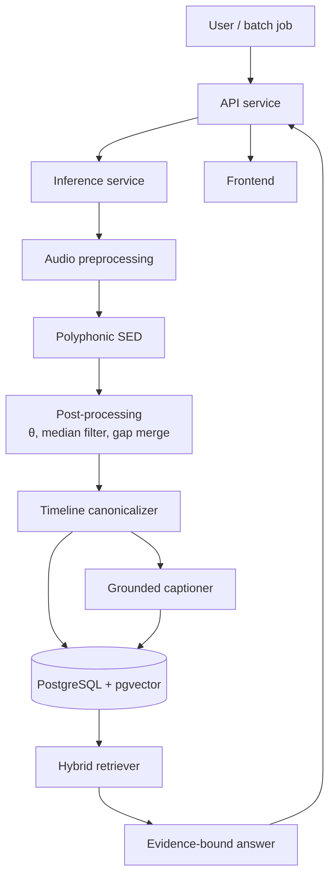
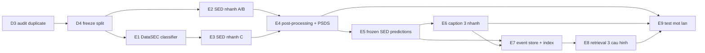

# SYSTEM.md — Đặc tả hệ thống

> **Tài liệu này mô tả kiến trúc đích và là khung của báo cáo khóa luận.**
> Nó **không** phải nguồn chân lý về phần đã chạy được. Muốn biết cái gì đã đo,
> đã chạy, đã kiểm chứng → [STATUS.md](STATUS.md).
>
> Quy ước đánh dấu trong toàn bộ tài liệu:
>
> | Dấu | Nghĩa |
> |---|---|
> | ✅ | Đã triển khai và có artifact kiểm chứng |
> | ◐ | Triển khai một phần, còn thiếu thành phần được nêu rõ |
> | ○ | Chưa triển khai, chỉ là thiết kế |
> | ⚠️ CẦN XÁC MINH | Con số hoặc claim chưa có bằng chứng trong repo |

---

## Phạm vi đã triển khai — đọc trước khi tin bất kỳ sơ đồ nào dưới đây

| Thành phần | Mức | Bằng chứng |
|---|---|---|
| Tải + verify archive (D0) | ✅ | [measurements/archive_audit_20260922.md](measurements/archive_audit_20260922.md) |
| Inventory DataSED (D1) | ✅ | `data/manifests/datased_inventory_summary.json` |
| Annotation contract DataSED (D2) | ✅ | `data/manifests/datased_preparation_audit.json` |
| Audit duplicate nội bộ DataSED | ✅ | 8 nhóm exact duplicate |
| Audit duplicate DataSEC + xuyên dataset (D3) | ○ | **Cổng đang chặn** |
| Split DataSED | ◐ | Candidate 435/142/140, chưa freeze vì chờ D3 |
| Log-mel v1 | ✅ | 717/717 file, `data/manifests/datased_logmel_v1.json` |
| SED baseline polyphonic | ✅ | frame macro-F1 test 0.359448 |
| Event-based F1 / PSDS | ○ | Chưa có post-processing hiệu chuẩn |
| DataSEC classifier | ○ | Archive đã verify, chưa giải nén |
| Transfer DataSEC → DataSED | ○ | Phụ thuộc D3 |
| Grounded caption | ○ | Chỉ có contract §6 |
| RAG / retrieval | ○ | Chỉ có thiết kế §7 |
| API / inference / frontend | ○ | Chỉ có thư mục scaffold |

---

## Mục lục

| Chương | Nội dung | Mục |
|---|---|---|
| 1 | Tổng quan đề tài | [§1](#1-tổng-quan-đề-tài) |
| 2 | Cơ sở lý thuyết và công trình liên quan | [§2](#2-cơ-sở-lý-thuyết-và-công-trình-liên-quan) |
| 3 | Dữ liệu | [§3](#3-dữ-liệu) |
| 4 | Kiến trúc hệ thống | [§4](#4-kiến-trúc-hệ-thống) |
| 5 | Mô hình: classification, SED và transfer | [§5](#5-mô-hình-classification-sed-và-transfer) |
| 6 | Grounded captioning | [§6](#6-grounded-captioning) |
| 7 | Tầng RAG | [§7](#7-tầng-rag) |
| 8 | Phương pháp đánh giá | [§8](#8-phương-pháp-đánh-giá) |
| 9 | MLOps và khả năng tái lập | [§9](#9-mlops-và-khả-năng-tái-lập) |
| 10 | Kế hoạch thực nghiệm | [§10](#10-kế-hoạch-thực-nghiệm) |
| 11 | Rủi ro, giả định và hạn chế | [§11](#11-rủi-ro-giả-định-và-hạn-chế) |
| 12 | Phụ lục | [§12](#12-phụ-lục) |

---

# 1. Tổng quan đề tài

## 1.1 Bối cảnh

Giám sát tiếng ồn môi trường ngoài trời đang chuyển từ đo mức áp suất âm tổng
(L<sub>Aeq</sub>) sang **phân tách nguồn**: không chỉ biết "ồn 68 dB" mà biết
*cái gì* gây ồn, *lúc nào* và *kéo dài bao lâu*. Chỉ số tổng không phân biệt được
một đêm ồn vì giao thông với một đêm ồn vì công trường, dù hai trường hợp cần
biện pháp xử lý hoàn toàn khác nhau.

Ba khoảng trống kỹ thuật làm việc này khó:

1. **Clip cô lập ≠ soundscape liên tục.** Hầu hết dataset phân loại âm thanh môi
   trường gồm clip đã tách sẵn một nguồn. Bản ghi thực tế có nhiều nguồn chồng
   lấp, nền thay đổi, và event dài không có biên rõ ràng.
2. **Nhãn mạnh thì đắt.** Gán onset/offset cho recording dài tốn công gấp nhiều
   lần gán nhãn mức clip, nên dataset có strong label luôn nhỏ.
3. **Mô tả bằng ngôn ngữ thì dễ bịa.** Mô hình sinh caption cho audio có xu hướng
   thêm nguồn âm không có trong tín hiệu, hoặc suy diễn nguyên nhân và bối cảnh
   mà bằng chứng âm học không hỗ trợ.

Khoảng trống thứ ba là lý do đề tài tồn tại. Một hệ thống nói "có tiếng còi báo
động lúc 5.4–6.1 s" thì kiểm chứng được; một hệ thống nói "có xe cứu thương chạy
qua trong tình huống khẩn cấp" thì không, dù cùng một tín hiệu đầu vào.

## 1.2 Phát biểu bài toán

Cho một bản ghi âm môi trường liên tục $x(t)$, hệ thống phải tạo ra:

1. **Event timeline** $E = \{(c_i, t^{on}_i, t^{off}_i, s_i)\}$ với $c_i$ thuộc
   taxonomy có version, $t^{on}_i < t^{off}_i$, $s_i \in [0,1]$ là confidence.
   Cho phép chồng lấp: $E$ là tập polyphonic.
2. **Caption** $y$ sinh **chỉ từ** $E$, sao cho mọi nguồn âm được nhắc trong $y$
   đều truy ngược được về ít nhất một $e_i \in E$.
3. **Câu trả lời truy vấn** cho câu hỏi ngôn ngữ tự nhiên $q$, kèm bằng chứng là
   tập `(recording_id, time_span)`.

Ràng buộc cốt lõi phân biệt đề tài này với audio captioning thông thường:

$$\text{mention}(y) \subseteq \text{classes}(E)$$

Caption không được chứa nguồn âm nằm ngoài timeline. Đây là ràng buộc cứng, kiểm
được bằng máy, không phải mục tiêu mềm.

```text
audio → SED → event timeline → grounded caption → event store → hybrid retrieval
```

## 1.3 Câu hỏi nghiên cứu

| ID | Câu hỏi | Metric trả lời | Điều kiện để câu trả lời có giá trị |
|---|---|---|---|
| **RQ1** | Pretraining trên DataSEC cải thiện SED trên DataSED đến mức nào? | Δ event-based macro-F1 và Δ PSDS giữa ba nhánh scratch / AudioSet / AudioSet+DataSEC | Cổng D3 pass — nếu DataSEC và DataSED trùng nguồn thì Δ là leakage, không phải transfer |
| **RQ2** | Caption bị ràng buộc timeline giảm hallucination bao nhiêu so với caption không ràng buộc? | Δ hallucination rate, Δ omission rate | Cùng SED prediction đóng băng cho cả hai nhánh |
| **RQ3** | Hybrid retrieval cải thiện Recall@k/MRR ra sao so với chỉ structured hoặc chỉ vector? | Recall@{1,5,10}, MRR, nDCG@10 | Query set xây trước khi xem kết quả |
| **RQ4** | Classifier phân cấp có tách được subclass trong các coarse class gộp không? | Subclass macro-F1 trên DataSEC test, parent-consistency trên DataSED | Chỉ kết luận trên DataSEC; DataSED không có subclass ground truth |

**RQ1 có một điều kiện tiên quyết dễ bị bỏ qua.** Hai dataset do cùng nhóm tác
giả công bố (Fredianelli, Artuso, Pompei, Licitra, Iannace, Akbaba), cùng miền đo
ngoài trời. Nếu một phần DataSEC được cắt ra từ chính các recording của DataSED,
thì "pretraining rồi fine-tune" trở thành "train trên test set". Xem §3.6.

## 1.4 Mục tiêu

**Mục tiêu chính:** xây pipeline tái lập được từ archive công bố đến câu trả lời
có bằng chứng, và đo được ba thứ mà hệ thống mô tả âm thanh thường không đo:
mức transfer, mức hallucination, và mức đóng góp của structured filter trong
retrieval.

**Mục tiêu cụ thể:**

| # | Mục tiêu | Nghiệm thu |
|---|---|---|
| O1 | Pipeline dữ liệu tái lập từ DOI đến split đóng băng | Mọi file có provenance; split có SHA-256; cổng D0–D5 pass |
| O2 | Baseline classification DataSEC 22 class | Macro-F1 + per-class table + calibration |
| O3 | Baseline SED DataSED 21 class polyphonic | Event-based F1 + PSDS, không chỉ frame-level |
| O4 | Đo transfer DataSEC → DataSED | Ba nhánh cùng training budget, cùng split |
| O5 | Grounded captioner + bộ metric hallucination | Hallucination rate đo được, contract có test |
| O6 | Hybrid retrieval có temporal predicate | Ba cấu hình so sánh được |
| O7 | Ứng dụng web minh họa đầu-cuối | Upload → timeline → caption → truy vấn |

## 1.5 Đóng góp

| ID | Đóng góp | Tính mới |
|---|---|---|
| **C1** | Grounded captioner cho soundscape môi trường với contract kiểm được bằng máy | Ràng buộc mention ⊆ timeline, có test tự động, không chỉ là prompt engineering |
| **C2** | Bộ metric đo factual grounding của caption âm thanh | Hallucination/omission/temporal-order/evidence-coverage, không phụ thuộc reference prose |
| **C3** | Đo transfer isolated → continuous **có kiểm soát leakage xuyên dataset** | Audit duplicate 3 tầng trước khi công bố Δ transfer |
| **C4** | RAG trên event timeline với temporal predicate | Truy vấn "A trước B", không chỉ semantic similarity |

C3 là đóng góp mà phần lớn nghiên cứu transfer bỏ qua: người ta báo Δ mà không
chứng minh hai dataset không trùng nguồn.

## 1.6 Phạm vi và giới hạn

### Trong phạm vi

- Audio môi trường ngoài trời, WAV hoặc chuyển đổi được sang WAV.
- Batch offline là bắt buộc.
- Polyphonic SED trên 21 class DataSED.
- Classification 22 coarse class + 28 subclass DataSEC.
- Caption tiếng Anh (benchmark) và tiếng Việt (giao diện).
- Truy vấn theo class, thời gian, duration, confidence và quan hệ trước–sau.

### Ngoài phạm vi — và vì sao

| Ngoài phạm vi | Lý do |
|---|---|
| Nhận dạng tiếng nói, nội dung hội thoại, nhận dạng người nói | Vi phạm quyền riêng tư; `voices` chỉ là nguồn âm, không phân tích nội dung |
| Suy luận tội phạm, ý định, tai nạn, tình trạng khẩn cấp | [ADR-0001](decisions/ADR-0001-scope-and-datasets.md); bằng chứng âm học không hỗ trợ kết luận này |
| Risk score, severity level, hệ thống cảnh báo | Hệ quả trực tiếp của dòng trên — không có cơ sở gán mức nguy hiểm cho `glass_breaking` |
| Tuyên bố triển khai an ninh trường học | Miền dữ liệu là tiếng ồn môi trường ngoài trời, không phải môi trường trường học |
| Stream gần thời gian thực | Mở rộng sau khi offline evaluation đóng băng; không nằm trong critical path |
| Định vị nguồn âm trong không gian | DataSED/DataSEC không có spatial label |
| Caption tự do không ràng buộc | Chính là thứ đề tài đo để so sánh, không phải thứ đề tài xuất bản |

> **Hệ quả cho báo cáo.** Mọi câu trong khóa luận phải mô tả *nguồn âm quan sát
> được*, không mô tả *tình huống*. "Phát hiện tiếng kính vỡ lúc 5.4 s" đúng.
> "Phát hiện đột nhập" sai — và sai về phương pháp, không chỉ về từ ngữ.

## 1.7 Cấu trúc tài liệu

| File | Trả lời câu hỏi |
|---|---|
| [CLAUDE.md](../CLAUDE.md) | Đang ở đâu, làm gì tiếp |
| **SYSTEM.md** (file này) | Hệ thống là gì — đặc tả đầy đủ |
| [PLAN.md](PLAN.md) | Làm gì, khi nào, nghiệm thu ra sao |
| [DATA_PLAN.md](DATA_PLAN.md) | Chuẩn bị dữ liệu thế nào |
| [taxonomy.md](taxonomy.md) | 22 class nghĩa là gì, ranh giới ở đâu |
| [annotation_guideline.md](annotation_guideline.md) | Xử lý nhãn thế nào |
| [evaluation_protocol.md](evaluation_protocol.md) | Số nào có nghĩa, số nào không |
| [TRAINING_OPS_PLAN.md](TRAINING_OPS_PLAN.md) | Chạy và theo dõi experiment |
| [STATUS.md](STATUS.md) | Hiện trạng có bằng chứng |
| [RELATED_WORK.md](RELATED_WORK.md) | Văn liệu và mức xác minh |
| [decisions/](decisions/) | Vì sao chọn thế này |
| [measurements/](measurements/) | Số đo sinh tự động |

---

# 2. Cơ sở lý thuyết và công trình liên quan

> Chương này là khung cho Chương 2 báo cáo. Mọi claim cần nguồn chính, DOI và
> ngày truy cập trước khi vào bản nộp — xem [RELATED_WORK.md](RELATED_WORK.md).
> Các mục dưới đây nêu *khái niệm và công thức* đề tài dùng, không phải survey.

## 2.1 Sound Event Detection

SED là bài toán dự đoán, cho mỗi frame thời gian $t$ và mỗi class $c$, xác suất
class đó đang active:

$$\hat{y}_{t,c} = \sigma(f_\theta(x)_{t,c}) \in [0,1]$$

Đây là **multi-label per frame**, không phải multi-class: nhiều class có thể
active cùng lúc, nên activation là sigmoid chứ không phải softmax, và loss là
binary cross-entropy trên từng ô $(t,c)$ chứ không phải categorical.

**Hai mức nhãn.**

| Loại | Nhãn cung cấp | Cho phép đo |
|---|---|---|
| Weak (clip-level) | Class có xuất hiện trong clip | Tagging, không đo được thời điểm |
| Strong (frame-level) | Class + onset + offset | Event-based F1, PSDS, và **grounding** |

DataSED cung cấp strong label, và đó là điều kiện cần cho C1: không có onset/offset
thì không có gì để ràng buộc caption vào.

**Từ frame prediction sang event list.** Đây là bước hậu xử lý, không phải bước
model, và nó quyết định phần lớn chênh lệch giữa frame-F1 và event-F1:

1. Nhị phân hóa: $b_{t,c} = \mathbb{1}[\hat{y}_{t,c} > \theta_c]$
2. Làm trơn: median filter độ rộng $w_c$ trên trục thời gian
3. Gộp đoạn liền kề thành event, bỏ event ngắn hơn $d^{min}_c$
4. Nối hai event cùng class cách nhau dưới $g^{max}_c$

Bốn tham số $(\theta_c, w_c, d^{min}_c, g^{max}_c)$ phải học từ dev/train, không
bao giờ từ test. Xem [evaluation_protocol.md](evaluation_protocol.md) §2.

## 2.2 Metric cho SED

**Frame-based (segment-based) F1** so khớp từng frame hoặc từng segment cố định.
Dễ tính, nhưng **không phản ánh chất lượng biên**: một model dự đoán đúng 90%
frame vẫn có thể tạo ra 50 event vụn thay vì 5 event đúng.

**Event-based F1** so khớp *event với event*, dùng collar dung sai:

- Onset khớp nếu $|t^{on}_{pred} - t^{on}_{ref}| \le \tau_{on}$
- Offset khớp nếu $|t^{off}_{pred} - t^{off}_{ref}| \le \max(\tau_{off}, \rho \cdot L_{ref})$

Collar tương đối $\rho \cdot L_{ref}$ tồn tại vì sai 1 giây trên event 2 giây khác
hẳn sai 1 giây trên event 60 giây.

**PSDS (Polyphonic Sound Detection Score)** tích phân hiệu năng trên toàn dải
operating point thay vì tại một threshold, nên không thưởng cho việc chọn θ may
mắn. PSDS dùng ba tham số kiểm soát độ khắt khe:

| Tham số | Nghĩa |
|---|---|
| DTC (Detection Tolerance Criterion) | Tỷ lệ tối thiểu của detection phải nằm trong ground truth |
| GTC (Ground Truth intersection Criterion) | Tỷ lệ tối thiểu của ground truth phải được detection phủ |
| CTTC (Cross-Trigger Tolerance Criterion) | Ngưỡng tính một detection là cross-trigger sang class khác |

> ⚠️ Baseline hiện tại trong [STATUS.md](STATUS.md) chỉ có **frame macro-F1
> 0.359448**. Con số đó **không** là event-based F1 và **không** so được với
> event-based F1 của bất kỳ paper nào.

## 2.3 Transfer learning cho biểu diễn âm thanh

Encoder pretrained trên corpus lớn (AudioSet ~2M clip, 527 class) cho biểu diễn
frame-level tổng quát tốt hơn encoder train từ đầu trên vài trăm recording.
Đề tài dùng ba nhánh để tách hai hiệu ứng khác nhau:

| Nhánh | Khởi tạo encoder | Trả lời |
|---|---|---|
| A — scratch | Random | Baseline dưới, đo bằng dữ liệu hiện có |
| B — AudioSet | PANNs CNN14 pretrained | Pretraining tổng quát đóng góp bao nhiêu |
| C — AudioSet + DataSEC | PANNs → fine-tune DataSEC → fine-tune DataSED | **DataSEC đóng góp thêm bao nhiêu** — RQ1 |

Chỉ có so sánh **C với B** trả lời RQ1. So C với A sẽ trộn hai nguyên nhân và báo
công của AudioSet thành công của DataSEC. Đây là lỗi thiết kế thí nghiệm dễ mắc.

**Domain shift cần đo, không được giả định bằng 0.** DataSEC là clip cô lập,
DataSED là soundscape liên tục. Ba lệch cụ thể:

1. **Lệch nền.** Clip DataSEC có nguồn chiếm ưu thế; recording DataSED có nền
   liên tục thay đổi.
2. **Lệch thời lượng.** Clip ngắn, recording DataSED trung bình
   $18.6847 \times 3600 / 717 \approx 93.8$ s.
3. **Lệch phân bố class.** DataSEC có `voices` 37.6% và `music` 19.8% — xem §3.4.

## 2.4 Automated Audio Captioning và hallucination

AAC sinh câu mô tả nội dung âm thanh. Vấn đề đã ghi nhận: model sinh ra nguồn âm
không có trong tín hiệu, do decoder học prior ngôn ngữ mạnh hơn bằng chứng âm học
("tiếng còi" → thường đi cùng "xe cứu thương" trong corpus text).

**Phân loại lỗi factual của caption:**

| Lỗi | Định nghĩa | Đo bằng |
|---|---|---|
| Hallucination | Caption nhắc nguồn âm không có trong timeline | Event precision |
| Omission | Timeline có event nhưng caption không nhắc | Event recall |
| Sai thứ tự | Thứ tự mention không khớp thứ tự onset | Temporal order accuracy |
| Suy diễn ngoài bằng chứng | Caption thêm nguyên nhân/bối cảnh/mức nguy hiểm | Kiểm bằng lexicon cấm |

**Metric n-gram (BLEU, METEOR, CIDEr, SPICE) không đo được bốn lỗi trên.** Một
caption bịa thêm "xe cứu thương" vẫn có thể được điểm BLEU cao nếu reference cũng
nhắc xe cứu thương. Vì vậy §8.3 định nghĩa bộ metric riêng, và n-gram chỉ là phụ.

## 2.5 Retrieval-Augmented Generation trên dữ liệu sự kiện

RAG cổ điển: embed câu hỏi → tìm document gần nhất → đưa vào LLM để sinh câu trả
lời. Dữ liệu của đề tài này có hai tính chất làm RAG thuần vector không đủ:

1. **Ràng buộc cứng.** "Sự kiện dài hơn 10 giây" là vị từ số học, không phải
   độ tương đồng ngữ nghĩa. Vector search có thể trả về event 3 giây vì caption
   của nó "nghe giống" câu hỏi.
2. **Quan hệ thời gian.** "Tiếng kính vỡ **trước** tiếng còi" cần so sánh
   timestamp giữa hai event trong cùng recording. Embedding không mã hóa được
   quan hệ này một cách đáng tin.

Nên §7 dùng **hybrid**: structured filter áp trước (không thể bị ghi đè), vector
search chỉ xếp hạng trong tập đã lọc.

## 2.6 Khoảng trống đề tài nhắm tới

```text
isolated classification transfer  (RQ1, có kiểm soát leakage)
  → polyphonic temporal detection (RQ1)
    → evidence-grounded caption   (RQ2, C1 + C2)
      → event-aware RAG retrieval (RQ3, C4)
```

Từng mắt đã có nghiên cứu riêng. Điểm đề tài đóng góp là **chuỗi liền mạch có
provenance xuyên suốt**: mọi câu trả lời cuối cùng truy được về recording ID,
time span, model version, split hash và taxonomy hash.

> ⚠️ CẦN XÁC MINH — claim "chưa có công trình nào làm cả chuỗi này trên DataSEC/
> DataSED" chỉ được viết vào báo cáo sau systematic search và bảng so sánh trong
> [RELATED_WORK.md](RELATED_WORK.md) §7.

---

# 3. Dữ liệu

## 3.1 Hai dataset, hai vai trò

| | DataSEC | DataSED |
|---|---|---|
| Record DOI | `10.5281/zenodo.17033970` | `10.5281/zenodo.15346092` |
| Concept DOI | `10.5281/zenodo.15340688` | `10.5281/zenodo.15346091` |
| Công bố | 2025-09-02 | 2025-05-05 |
| License | `cc-by-nc-sa-4.0` | `cc-by-nc-sa-4.0` |
| Archive | `DATASEC.zip`, 6,414,663,316 B | `DataSED…zip`, 4,510,378,259 B |
| MD5 | `29fa9b8cc84cfa69aa4e5e674e780383` | `44e093f675fc44cfb8a11b68456b72d7` |
| File audio | 5,048 WAV | 717 WAV |
| Giải nén | 7.01 GiB | 5.55 GiB |
| Nhãn nằm ở | **Cây thư mục** | **2 file CSV** |
| Loại nhãn | Clip-level, có hierarchy | Strong label onset/offset |
| Vai trò | Classification, encoder pretraining, subclass | **Benchmark SED chính** |
| Không dùng để | Đánh giá SED trong soundscape | Đánh giá subclass bị gộp |

Nguồn: [measurements/archive_audit_20260922.md](measurements/archive_audit_20260922.md),
sinh bằng `python -m scripts.report_archive_audit datasec datased`.

### Hai điều cần biết trước khi viết script xử lý

**1. Không archive nào chứa LICENSE hoặc README.** Audit đếm được 0 file
documentation trong cả hai ZIP. License chỉ lấy được từ Zenodo record metadata đã
lưu tại `data/reference/zenodo_<dataset>_<record>.json`. Mọi câu trong tài liệu
hay code giả định "đọc LICENSE trong archive" đều sai.

**2. Hai dataset có cơ chế nhãn khác nhau.** DataSEC mã hóa nhãn bằng đường dẫn
`DATASEC/<coarse>/<subclass>/file.wav`; DataSED dùng bảng CSV. Do đó
`ml/dataops/archive_audit.py` nhận `label_depth=None` cho DataSED chứ không cố
suy nhãn từ tên thư mục `SED_wav`/`SED_ground_truth`.

## 3.2 Ràng buộc license CC-BY-NC-SA-4.0

Ba thành phần của license, và hệ quả cụ thể cho đề tài:

| Thành phần | Hệ quả |
|---|---|
| **BY** — Attribution | Phải trích dẫn cả hai DOI trong báo cáo và trong `data/reference/`. Không đủ khi chỉ ghi tên dataset |
| **NC** — NonCommercial | Khóa luận học thuật hợp lệ. Không được dùng artifact cho sản phẩm thương mại |
| **SA** — ShareAlike | **Derivative phải cùng license.** Áp cho log-mel feature, checkpoint train trên dữ liệu này, và caption sinh từ nó |

**Hệ quả thực tế của SA:** nếu công bố checkpoint, phải công bố dưới CC-BY-NC-SA-4.0,
không phải MIT/Apache. Code pipeline là tác phẩm độc lập nên có thể license riêng,
nhưng weights thì không.

## 3.3 Taxonomy 22 coarse class

Định nghĩa đầy đủ từng class: [taxonomy.md](taxonomy.md). Ở đây chỉ nêu cấu trúc
và ràng buộc kỹ thuật.

- **22 coarse class**, định nghĩa duy nhất trong `ml/configs/taxonomy.yaml`.
- **28 subclass** thuộc 10 coarse class, chỉ tồn tại trong DataSEC.
- **21 class** cho polyphonic SED head: `wind_turbine` không thuộc polyphonic
  label set của DataSED.
- **22 class** cho monophonic benchmark phụ.

Class order **chỉ** được định nghĩa trong config có version. Checkpoint phải lưu
`taxonomy_sha256`; hiện tại là
`67ca8a8c53278cd438d7d06a4ba09e277f3f9a6df99460bdbec1d3a927729a3a`.

`background`, `silence`, `unknown` là **trạng thái**, không phải event head.

### Hai class gộp là vấn đề trung tâm của RQ4

DataSED gộp các nguồn âm khác nhau vào một nhãn:

| Coarse class | Subclass DataSEC | Vấn đề |
|---|---|---|
| `sirens_and_alarms` | `Sirens` (68), `Alarms` (37) | Còi xe và báo động tại chỗ có ý nghĩa khác nhau nhưng cùng nhãn SED |
| `thunder_fireworks_gunshot` | `Thunder` (26), `Fireworks` (68), `Gunshot` (141) | Ba nguồn hoàn toàn khác nhau; sấm là hiện tượng tự nhiên, hai cái còn lại do người |

Subclass classifier **có thể** dự đoán, nhưng DataSED **không có** ground truth
để xác nhận. Vì vậy caption phải diễn đạt coarse khi chỉ có coarse evidence — xem
§6.4 và [taxonomy.md](taxonomy.md) §5.

## 3.4 Phân bố DataSEC — lệch 38:1 và hệ quả

Số liệu từ `data/manifests/datasec_archive_audit.json`:

| Coarse class | Files | Share | Subclass (files) |
|---|---:|---:|---|
| `voices` | 1,900 | 37.6% | — |
| `music` | 1,001 | 19.8% | — |
| `thunder_fireworks_gunshot` | 235 | 4.7% | Gunshot 141, Fireworks 68, Thunder 26 |
| `workshop` | 218 | 4.3% | jackhammer 63, drill 45, saw 42, grinder 38, air compressor 30 |
| `vehicle_pass_by` | 217 | 4.3% | car 110, motorbike 57, truck 50 |
| `lawn_mower_brush_cutter_olive_shaker` | 127 | 2.5% | brush cutter 86, lawn mower 21, olive shaker 20 |
| `vehicle_idling` | 112 | 2.2% | car truck 81, motorbike 31 |
| `glass_breaking` | 109 | 2.2% | — |
| `propeller_aircrafts` | 108 | 2.1% | helicopters 58, airplanes 50 |
| `crows_seagulls_magpies` | 106 | 2.1% | crows 50, seagulls 35, magpies 21 |
| `sirens_and_alarms` | 105 | 2.1% | sirens 68, alarms 37 |
| `jet_aircrafts` | 103 | 2.0% | — |
| `wind_turbine` | 100 | 2.0% | — |
| `vacuum_cleaner_fan_hairdryer` | 95 | 1.9% | fan 32, hairdryer 32, vacuum cleaner 31 |
| `cicadas_and_crickets` | 74 | 1.5% | cicadas 54, crickets 20 |
| `dog_barkings_and_howlings` | 70 | 1.4% | — |
| `birds` | 69 | 1.4% | — |
| `bells` | 67 | 1.3% | — |
| `train` | 67 | 1.3% | — |
| `chicken_coop` | 58 | 1.1% | — |
| `horn` | 57 | 1.1% | — |
| `cat_fights_and_moans` | 50 | 1.0% | — |
| **Tổng** | **5,048** | 100% | 28 subclass |

### Ba hệ quả thiết kế, không phải ba ghi chú

**1. `voices` + `music` = 57.5% dataset.** Đây là hai class ít liên quan nhất tới
"tiếng ồn môi trường ngoài trời" theo nghĩa đánh giá tác động tiếng ồn, nhưng lại
chiếm hơn nửa dữ liệu pretraining. Nếu pretrain DataSEC bằng sampling đồng nhất,
encoder học chủ yếu phân biệt giọng nói với nhạc — và RQ1 sẽ đo "AudioSet cộng
thêm một encoder chuyên voices/music giúp gì cho SED môi trường", không phải câu
hỏi ta muốn hỏi.

→ **Quyết định:** pretraining DataSEC dùng class-balanced sampling hoặc loss
weighting. Ghi trong [ADR-0002](decisions/ADR-0002-encoder-va-nhanh-transfer.md).

**2. Lệch coarse 38:1** (`voices` 1,900 / `cat_fights_and_moans` 50). Macro-F1 là
metric đúng vì nó cho mỗi class trọng số bằng nhau, nhưng training bằng
unweighted BCE sẽ bỏ rơi class nhỏ.

**3. Bốn subclass có dưới 25 file** — và đây là ràng buộc cứng lên evaluation:

| Subclass | Files | Với split 70/15/15 → dev / test |
|---|---:|---|
| `cicadas_and_crickets/Crickets` | 20 | 3 / 3 |
| `lawn_mower…/Olive shaker` | 20 | 3 / 3 |
| `crows_seagulls_magpies/Magpies` | 21 | 3 / 3 |
| `lawn_mower…/Lawn mower` | 21 | 3 / 3 |

Một metric per-subclass tính trên 3 file có bước nhảy 33 điểm phần trăm. **F1 của
các node này không phải số có nghĩa** — xem [evaluation_protocol.md](evaluation_protocol.md)
§4 về cách báo cáo nhóm low-support.

## 3.5 Phân bố DataSED

Nguồn: `data/manifests/datased_inventory_summary.json`,
`datased_preparation_audit.json`.

| Trường | Giá trị |
|---|---:|
| WAV | 717 |
| Tổng thời lượng | 18.6847 giờ |
| Thời lượng trung bình / recording | ≈ 93.8 s |
| Sample rate | 44,100 Hz (717/717) |
| Channel | mono 716, stereo 1 |
| Exact duplicate (SHA-256) | 8 nhóm × 2 recording |
| Polyphonic events | 4,034 trên 21 class, phủ 703/717 recording |
| Monophonic events | 4,309 trên 22 class, phủ 717/717 recording |

**14 recording không có polyphonic target event.** Chúng được giữ làm recording
âm tính, không bị loại: một hệ thống SED phải đúng cả khi không có gì xảy ra, và
bỏ chúng đi sẽ làm false-positive rate trông tốt hơn thực tế.

**1 file stereo giữa 716 file mono** là bẫy im lặng: nếu loader không ép mono,
file đó có shape khác và hoặc crash hoặc bị broadcast sai. `ml/features/logmel.py`
gọi `librosa.load(..., mono=True)` nên đã xử lý.

### Schema annotation DataSED

```text
sound_name,class_name,start_perc,end_perc,start_time,end_time,event_length
S-0001.wav,Birds,0.00,0.30,0.00,17.60,17.60
```

Hai cách biểu diễn thời gian cùng tồn tại: phần trăm (`start_perc`) và giây
(`start_time`). **Dùng giây làm nguồn chân lý**, phần trăm chỉ để kiểm tra chéo;
phần trăm làm tròn 2 chữ số nên trên recording 90 s có sai số tới 0.9 s.

## 3.6 Duplicate và leakage — cổng D3

Đây là rủi ro lớn nhất của RQ1 và là cổng đang chặn.

**Vì sao rủi ro cao hơn bình thường:** hai dataset cùng 6 tác giả, cùng miền đo
ngoài trời, công bố cách nhau 4 tháng. Giả định mặc định phải là "có khả năng
trùng nguồn" cho đến khi đo được ngược lại.

**Ba tầng phát hiện:**

| Tầng | Phát hiện | Công cụ | Trạng thái |
|---|---|---|---|
| T1 — Cryptographic | File byte-identical | SHA-256 | ✅ DataSED: 8 nhóm |
| T2 — Signature | Cùng nội dung, khác container/encode | (duration, sample_rate, frames) + hash của decoded PCM | ○ |
| T3 — Acoustic | Cùng nguồn, khác đoạn cắt hoặc xử lý | Fingerprint chroma/MFCC + so khớp ngưỡng | ○ |

**Ba kiểm tra phải chạy:**

1. Duplicate bên trong DataSEC.
2. Duplicate bên trong DataSED. ✅ (T1)
3. **Duplicate xuyên DataSEC–DataSED.** ○ — quan trọng nhất.

**Luật xử lý khi tìm thấy cặp xuyên dataset:**

```text
Nếu clip DataSEC trùng nguồn với recording DataSED:
    Nếu recording DataSED đó thuộc test hoặc dev:
        → LOẠI clip DataSEC khỏi pretraining
    Ngược lại (thuộc train):
        → GIỮ, nhưng ghi vào duplicate group manifest
Mọi trường hợp: cả group phải nằm cùng một evaluation boundary
```

Không được chia một duplicate group qua hai split. Chi tiết thuật toán và ngưỡng:
[DATA_PLAN.md](DATA_PLAN.md) §7.

> **Nếu D3 phát hiện trùng lặp đáng kể**, Δ transfer của RQ1 mất giá trị và phải
> báo cáo trung thực là leakage, không được diễn giải thành thành công của
> pretraining. Đây là kết quả âm tính hợp lệ, không phải thất bại của khóa luận.

## 3.7 Split

| | DataSEC | DataSED |
|---|---|---|
| Đơn vị split | Duplicate/content group | **Recording group** |
| Tỉ lệ | 70/15/15 | 70/15/15 |
| Phương pháp | Stratify theo coarse (+subclass nếu khả thi) | Iterative multilabel stratification |
| Hiện trạng | ○ | ◐ candidate 435/142/140 |
| SHA-256 | — | `656c1851de7c22a5eb6b2c2dc2b20397ad1bce98b136c591b7fe68b88cd130b1` |

Split DataSED **chưa freeze**: phải chạy lại sau D3 vì duplicate group có thể
buộc recording đổi split.

Cài đặt: `ml/dataops/splits.py::grouped_multilabel_split`, dùng
`MultilabelStratifiedShuffleSplit` hai lần (train vs holdout, rồi dev vs test),
seed 20260922. Hàm này **ép** mỗi item thuộc đúng một group và raise nếu không.

## 3.8 Tiền xử lý — log-mel v1

`ml/features/logmel.py::LogMelConfig`:

| Tham số | Giá trị | Lý do |
|---|---:|---|
| `sample_rate` | 16,000 Hz | Chuẩn của PANNs; giảm từ 44.1 kHz gốc |
| `n_fft` | 1,024 | 64 ms cửa sổ |
| `hop_length` | 320 | → **50 frame/s**, đủ phân giải cho onset |
| `n_mels` | 64 | Đánh đổi giữa chi tiết phổ và bộ nhớ |
| `fmin` / `fmax` | 20 / 8,000 Hz | Nyquist tại 16 kHz |
| `top_db` | 80 | Chuẩn hóa về $[0,1]$ |
| Lưu trữ | `float16` | Giảm một nửa dung lượng |

Chuẩn hóa: `power_to_db(ref=max)` rồi `(dB + top_db) / top_db`, clip vào $[0,1]$.
`ref=np.max` là **per-file**, nên mất thông tin mức tuyệt đối giữa các file.
Với SED tương đối thì chấp nhận được; nếu sau này cần so mức áp suất âm tuyệt đối
thì phải đổi sang ref cố định và tạo `logmel_v2`.

Config có `checksum` (SHA-256 của config đã sort key) để feature manifest ghi
được version. Artifact: `data/manifests/datased_logmel_v1.{csv,json}`, 717/717 file.

## 3.9 Cổng dữ liệu D0–D5

| Gate | Điều kiện | Trạng thái |
|---|---|---|
| **D0** | Metadata/license/checksum đã lưu; archive khớp size + MD5 | ✅ cả hai dataset |
| **D1** | Giải nén xong, inventory hoàn tất (sample rate, duration, channels, hash) | ✅ DataSED · ○ DataSEC |
| **D2** | Annotation contract pass (onset/offset hợp lệ, class trong taxonomy) | ✅ DataSED |
| **D3** | Audit duplicate T1–T3, nội bộ và xuyên dataset | ◐ **cổng đang chặn** |
| **D4** | Split freeze + leakage check pass | ○ |
| **D5** | Loader/frame alignment tests pass | ◐ |

**Không huấn luyện benchmark chính trước D4.** Baseline hiện tại chạy trên split
candidate và vì vậy là số dò đường, không phải số báo cáo.

---

# 4. Kiến trúc hệ thống

## 4.1 Tổng quan



Ranh giới quan trọng nhất: **`POST` nằm trong inference service, không nằm trong
model.** Tham số θ và median filter là artifact của quá trình hiệu chuẩn trên dev,
được lưu cùng checkpoint và load ra lúc serve. Nếu để chúng hardcode trong model
thì không thể đổi operating point mà không train lại.

## 4.2 Danh sách service

| Service | Trách nhiệm | Không được chứa | Trạng thái |
|---|---|---|---|
| `api` | Upload, validation, persistence, orchestration, response envelope | PyTorch, checkpoint, model loading | ○ |
| `inference` | Preprocessing, SED, post-processing, caption | Business persistence, SQL | ○ |
| `frontend` | Timeline, caption, search, evidence, provenance | Hằng số taxonomy tự khai | ○ |
| `stream` | Chunking, overlap-add, event stitching, backpressure | Logic training/benchmark | ○ |

**Vì sao `api` không được load model.** Ba lý do cụ thể: (1) scale độc lập — API
là I/O-bound, inference là compute-bound; (2) API restart không phải chờ load
checkpoint; (3) test API không cần GPU. Ràng buộc này đã ghi trong
[AGENTS.md](../AGENTS.md) và phải kiểm bằng CI (grep `import torch` trong
`services/api/`).

## 4.3 Lược đồ cơ sở dữ liệu

PostgreSQL 16 + pgvector. Quyết định và lý do:
[ADR-0005](decisions/ADR-0005-database-va-vector-store.md).

```sql
-- Bản ghi gốc. Một dòng cho mỗi file audio đưa vào hệ thống.
CREATE TABLE recordings (
    recording_id    TEXT PRIMARY KEY,           -- 'datased:S-0001' hoặc 'upload:<uuid>'
    source_dataset  TEXT,                       -- 'datased' | 'datasec' | 'upload'
    source_id       TEXT,                        -- ID trong dataset gốc
    duration_s      REAL    NOT NULL CHECK (duration_s > 0),
    sample_rate     INTEGER NOT NULL,
    channels        SMALLINT NOT NULL,
    sha256          CHAR(64) NOT NULL,           -- dedup + provenance
    split           TEXT,                        -- 'train'|'validation'|'test'|NULL
    captured_at     TIMESTAMPTZ,                 -- NULL nếu dataset không cung cấp
    ingested_at     TIMESTAMPTZ NOT NULL DEFAULT now(),
    audio_path      TEXT,                        -- NULL sau khi retention xoá
    UNIQUE (source_dataset, source_id)
);

-- Event sau post-processing. Đơn vị bằng chứng của toàn hệ thống.
CREATE TABLE events (
    event_id        BIGSERIAL PRIMARY KEY,
    recording_id    TEXT NOT NULL REFERENCES recordings(recording_id) ON DELETE CASCADE,
    class_id        TEXT NOT NULL,               -- 1 trong 21 polyphonic class
    onset_s         REAL NOT NULL CHECK (onset_s >= 0),
    offset_s        REAL NOT NULL,
    score           REAL NOT NULL CHECK (score BETWEEN 0 AND 1),
    label_mode      TEXT NOT NULL,               -- 'polyphonic' | 'monophonic'
    provenance      TEXT NOT NULL,               -- 'ground_truth' | 'prediction'
    model_version   TEXT,                        -- NULL khi provenance='ground_truth'
    taxonomy_version TEXT NOT NULL,
    CHECK (offset_s > onset_s)
);

-- Subclass refinement. Bảng riêng vì nó KHÔNG phải ground truth trên DataSED.
CREATE TABLE event_subclass_predictions (
    event_id        BIGINT NOT NULL REFERENCES events(event_id) ON DELETE CASCADE,
    subclass_id     TEXT NOT NULL,
    score           REAL NOT NULL CHECK (score BETWEEN 0 AND 1),
    model_version   TEXT NOT NULL,
    verifiable      BOOLEAN NOT NULL,            -- FALSE khi dataset không có subclass GT
    PRIMARY KEY (event_id, subclass_id, model_version)
);

-- Caption sinh từ timeline.
CREATE TABLE captions (
    caption_id      BIGSERIAL PRIMARY KEY,
    recording_id    TEXT NOT NULL REFERENCES recordings(recording_id) ON DELETE CASCADE,
    language        CHAR(2) NOT NULL,            -- 'en' | 'vi'
    text            TEXT NOT NULL,
    captioner_version TEXT NOT NULL,
    grounding_mode  TEXT NOT NULL,               -- 'constrained' | 'unconstrained' (ablation)
    created_at      TIMESTAMPTZ NOT NULL DEFAULT now()
);

-- Liên kết caption ↔ event. Bảng này LÀ định nghĩa của "grounded".
-- Một caption không có dòng nào ở đây là caption không có bằng chứng.
CREATE TABLE caption_evidence (
    caption_id      BIGINT NOT NULL REFERENCES captions(caption_id) ON DELETE CASCADE,
    event_id        BIGINT NOT NULL REFERENCES events(event_id) ON DELETE CASCADE,
    mention_span    INT4RANGE,                   -- vị trí ký tự trong caption.text
    PRIMARY KEY (caption_id, event_id)
);

-- Document cho retrieval. Tách khỏi captions để đổi embedding model
-- mà không phải sinh lại caption.
CREATE TABLE retrieval_documents (
    document_id     BIGSERIAL PRIMARY KEY,
    recording_id    TEXT NOT NULL REFERENCES recordings(recording_id) ON DELETE CASCADE,
    text            TEXT NOT NULL,               -- caption + canonical event summary
    embedding       VECTOR(1024),                -- BGE-M3
    embedding_version TEXT NOT NULL,
    class_ids       TEXT[] NOT NULL,             -- denormalize để filter nhanh
    total_events    INTEGER NOT NULL,
    max_polyphony   SMALLINT NOT NULL,
    UNIQUE (recording_id, embedding_version)
);

-- Sổ ghi experiment. Mọi số trong báo cáo phải join được về đây.
CREATE TABLE runs (
    run_id          TEXT PRIMARY KEY,
    task            TEXT NOT NULL,               -- 'classification'|'sed'|'caption'|'retrieval'
    config_sha256   CHAR(64) NOT NULL,
    data_manifest_sha256 CHAR(64) NOT NULL,
    split_sha256    CHAR(64) NOT NULL,
    taxonomy_sha256 CHAR(64) NOT NULL,
    code_revision   TEXT NOT NULL,
    seed            INTEGER NOT NULL,
    primary_metric  TEXT NOT NULL,
    primary_value   REAL,
    complete        BOOLEAN NOT NULL DEFAULT FALSE,
    created_at      TIMESTAMPTZ NOT NULL DEFAULT now()
);

-- Index
CREATE INDEX events_recording_onset_idx ON events (recording_id, onset_s);
CREATE INDEX events_class_onset_idx     ON events (class_id, onset_s);
CREATE INDEX events_duration_idx        ON events ((offset_s - onset_s));
CREATE INDEX docs_class_gin_idx         ON retrieval_documents USING gin (class_ids);
CREATE INDEX docs_embedding_hnsw_idx    ON retrieval_documents
    USING hnsw (embedding vector_cosine_ops);
```

### Bốn quyết định schema đáng giải thích

**1. `event_subclass_predictions.verifiable`.** Cột boolean này tồn tại để chống
một lỗi diễn giải cụ thể: đọc subclass prediction trên DataSED như thể nó là sự
thật. Khi `verifiable = FALSE`, frontend phải hiển thị kèm cảnh báo và metric
không được tính precision/recall trên nó.

**2. `caption_evidence` là bảng riêng, không phải cột array.** Vì nó là *định
nghĩa* của grounded caption: caption không có dòng evidence là caption không hợp
contract. Bảng riêng cho phép ràng buộc khóa ngoại thật, và cho phép ablation
`unconstrained` tồn tại song song để so sánh (RQ2).

**3. `retrieval_documents` tách khỏi `captions`.** Đổi embedding model là việc sẽ
xảy ra. Tách bảng cho phép giữ nhiều `embedding_version` cùng lúc và so sánh
retrieval mà không sinh lại caption.

**4. `provenance` trên `events`.** Cùng một bảng chứa cả ground truth DataSED và
prediction của model. Không tách bảng vì retrieval cần truy vấn thống nhất, nhưng
**bắt buộc** có cột phân biệt, nếu không sẽ đánh giá model trên chính output của nó.

## 4.4 Hợp đồng API

Tiền tố `/api/v1`. Mọi response dùng envelope `{success, data, error, meta}`.

| Nhóm | Endpoint | Method | Mô tả |
|---|---|---|---|
| Ingest | `/audio/upload` | POST | Upload file, xử lý offline, trả `recording_id` |
| Recordings | `/recordings` | GET | Lọc `from`, `to`, `class`, `split`, phân trang |
| Recordings | `/recordings/{id}` | GET | Metadata + timeline + caption |
| Recordings | `/recordings/{id}/timeline` | GET | Event list kèm `model_version` |
| Recordings | `/recordings/{id}/audio` | GET | Stream audio để phát lại |
| Captions | `/recordings/{id}/caption` | GET | Caption + `caption_evidence` |
| Retrieval | `/retrieval/query` | POST | `{question, filters?, mode?}` → `{answer, evidence[], documents[]}` |
| Models | `/models/status` | GET | Model version active, taxonomy hash, metric |
| Health | `/health` | GET | Liveness/readiness thật |

**Ba ràng buộc bắt buộc, vi phạm là lỗi hệ thống:**

1. `/retrieval/query` **luôn** trả `evidence[]` gồm `(recording_id, onset_s,
   offset_s)`. Câu trả lời không có evidence không phải câu trả lời hợp lệ —
   phải trả danh sách rỗng kèm constraint đã áp.
2. Mọi response chứa prediction **phải** có `model_version` và `taxonomy_version`.
3. `/health` phải phản ánh readiness thật của database và model. Không trả `200`
   khi model chưa load.

## 4.5 Bảng công nghệ

| Tầng | Lựa chọn | Lý do |
|---|---|---|
| Feature | log-mel 64 mel, 50 fps, precompute `.npy` | Đã triển khai; đủ phân giải onset; tránh decode lại mỗi epoch |
| Encoder baseline | CNN 3 block + BiGRU (`ml/models/audio.py`) | Đã có số đo, làm baseline dưới |
| Encoder đề xuất | PANNs CNN14 pretrained AudioSet | [ADR-0002](decisions/ADR-0002-encoder-va-nhanh-transfer.md) |
| SED metric | `sed_eval`, `psds_eval` | Không tự viết lại metric đã có chuẩn |
| Caption baseline | Template sinh từ timeline | Grounding đúng 100% theo thiết kế, làm sàn so sánh |
| Embedding | BGE-M3, 1024-dim | [ADR-0004](decisions/ADR-0004-embedding-cho-retrieval.md) |
| Backend | FastAPI + Pydantic v2 + SQLAlchemy 2.0 | Async-native; một framework cho api + inference |
| Database | PostgreSQL 16 + pgvector | [ADR-0005](decisions/ADR-0005-database-va-vector-store.md) |
| Frontend | React + Vite + TanStack Query | Timeline cần state phức tạp |
| LLM cho answer | Interface pluggable, không khóa nhà cung cấp | Answer phải bị ràng buộc bởi evidence, không phụ thuộc model cụ thể |
| Triển khai | Docker Compose | Một node, đủ cho demo khóa luận |
| GPU | RTX 3070 Laptop, 8 GB | Giới hạn thật: batch size và model size phải vừa 8 GB |

---

# 5. Mô hình: classification, SED và transfer

## 5.1 Kiến trúc hiện tại

`ml/models/audio.py`, đã triển khai và đã đo:

```text
Input: (B, 1, n_mels=64, T)   log-mel, 50 frame/s

AudioEncoder
  ConvBlock(1  → 32)   Conv3x3 ×2 + BN + ReLU, MaxPool(2,1)
  ConvBlock(32 → 64)   Conv3x3 ×2 + BN + ReLU, MaxPool(2,1)
  ConvBlock(64 → 128)  Conv3x3 ×2 + BN + ReLU, MaxPool(2,1)
  mean over mel axis   → (B, 128, T)

SoundEventDetector                      AudioClassifier
  BiGRU(128 → 128×2)                      mean over time
  Dropout(0.2)                            Dropout(0.2)
  Linear(256 → 21)                        Linear(128 → 22)
  → (B, T, 21) frame logits               → (B, 22) clip logits
```

**Chi tiết quan trọng: `MaxPool(kernel=(2,1))` chỉ pool trục mel, không pool trục
thời gian.** Nên frame rate đầu ra bằng đầu vào — 50 fps. Đây là lựa chọn có chủ
ý: pool thời gian sẽ làm mất phân giải onset, mà onset chính là thứ grounding cần.
Đánh đổi là chi phí tính toán cao hơn.

`load_classifier_encoder()` cho phép nạp encoder từ checkpoint classifier vào SED
model với `strict=True` — đây là cơ chế transfer DataSEC → DataSED.

## 5.2 Ba nhánh thí nghiệm cho RQ1

| Nhánh | Encoder init | Fine-tune | Vai trò |
|---|---|---|---|
| **A** | Random | DataSED | Baseline dưới ✅ đã chạy |
| **B** | PANNs CNN14 (AudioSet) | DataSED | Đo đóng góp pretraining tổng quát |
| **C** | PANNs CNN14 → DataSEC | DataSED | Đo đóng góp **thêm** của DataSEC |

**So sánh trả lời RQ1 là C − B, không phải C − A.** Ba nhánh phải dùng: cùng
split, cùng seed set, cùng training budget (epoch × batch), cùng post-processing
được hiệu chuẩn độc lập trên dev của từng nhánh.

**Nhánh C phải dùng class-balanced sampling khi pretrain DataSEC**, vì §3.4:
không cân bằng thì 57.5% gradient đến từ `voices` và `music`.

## 5.3 Hàm mất mát

**SED (multi-label per frame):**

$$\mathcal{L}_{SED} = \frac{1}{|M|}\sum_{(t,c) \in M} w_c \left[ -y_{t,c}\log\hat{y}_{t,c} - (1-y_{t,c})\log(1-\hat{y}_{t,c}) \right]$$

với $M$ là tập ô **không bị padding mask** — frame padding không được vào loss.
$w_c$ là `pos_weight` per class.

**`pos_weight` hiện tại được clip ở 50.** Manifest baseline cho thấy 6 class đạt
trần: `bells`, `cat_fights_and_moans`, `chicken_coop`, `crows_seagulls_magpies`,
`glass_breaking`, `horn`. Trần này là tham số cần ablation, không phải hằng số
hiển nhiên — project tiền nhiệm đã đo và thấy `pos_weight` ảnh hưởng lớn tới
kết quả. ⚠️ CẦN XÁC MINH trên dữ liệu của đề tài này.

**Classification (multi-class, 22 coarse):** cross-entropy có class weight hoặc
balanced sampling. Với subclass head, thêm ràng buộc phân cấp:

$$\mathcal{L} = \mathcal{L}_{coarse} + \lambda \cdot \mathcal{L}_{subclass} + \mu \cdot \mathcal{L}_{consistency}$$

$\mathcal{L}_{consistency}$ phạt trường hợp subclass thắng không thuộc coarse
thắng. Không có nó, model có thể dự đoán `sirens_and_alarms` ở coarse nhưng
`gunshot` ở subclass — vô nghĩa về mặt cấu trúc.

## 5.4 Chi tiết huấn luyện baseline đã chạy

Từ `ml/runs/sed_polyphonic_20260922T115340Z/manifest.json`:

| Tham số | Giá trị |
|---|---:|
| Epochs | 8 |
| Batch size | 8 |
| Learning rate | 1e-3 |
| Weight decay | 1e-4 |
| Window | 500 frame = 10 s |
| Hop | 500 frame (không overlap) |
| Threshold | 0.5 (cố định, **chưa hiệu chuẩn**) |
| Seed | 20260922 |
| Windows train/val/test | 4,278 / 1,467 / 1,344 |
| Torch | 2.11.0+cu128 |
| GPU | RTX 3070 Laptop |

Kết quả: best val frame macro-F1 **0.357305**, test frame macro-F1 **0.359448**,
test frame mAP **0.466312** trên 671,570 frame.

**Bốn giới hạn của số này, phải nêu mỗi lần trích dẫn:**

1. Frame-level, **không** phải event-based — không so được với paper.
2. Threshold 0.5 cố định, chưa hiệu chuẩn per-class.
3. Chạy trên split **candidate**, chưa qua D3/D4.
4. 8 epoch — chưa có bằng chứng đã hội tụ.

## 5.5 Post-processing

Bốn tham số per class, học từ train/dev:

| Tham số | Nguồn học | Không được học từ |
|---|---|---|
| $\theta_c$ — threshold | Dev, sweep tối ưu event-based F1 | Test |
| $w_c$ — median filter | Train duration statistics | Dev hoặc test |
| $d^{min}_c$ — event tối thiểu | Train duration percentile | Test |
| $g^{max}_c$ — gap gộp | Train inter-event gap | Test |

**$w_c$, $d^{min}_c$, $g^{max}_c$ suy từ TRAIN, không từ dev.** Lý do: chúng là
duration prior, và suy chúng từ chính tập đang chấm là rò rỉ dù tập đó là dev.
Chi tiết: [ADR-0003](decisions/ADR-0003-threshold-va-post-processing.md).

## 5.6 Ablation dự kiến

| # | Ablation | Trả lời |
|---|---|---|
| A1 | Nhánh A vs B vs C | RQ1 |
| A2 | Global θ vs per-class θ | Post-processing đóng góp bao nhiêu |
| A3 | Có vs không median filter | Fragmentation ảnh hưởng event-F1 bao nhiêu |
| A4 | `pos_weight` trần {10, 30, 50, không clip} | Imbalance handling |
| A5 | Coarse-only vs hierarchical trên DataSEC | RQ4 |
| A6 | Class-balanced vs uniform sampling khi pretrain DataSEC | §3.4 |

---

# 6. Grounded captioning

## 6.1 Contract đầu vào

Captioner nhận **duy nhất** event timeline sau post-processing. Không nhận audio,
không nhận spectrogram, không nhận metadata bối cảnh.

```json
{
  "recording_id": "datased:S-0001",
  "duration_s": 93.8,
  "taxonomy_version": "0.1",
  "model_version": "sed-v1.0",
  "events": [
    {"event_id": 1, "class_id": "birds", "onset_s": 0.0, "offset_s": 17.6, "score": 0.88},
    {"event_id": 2, "class_id": "bells", "onset_s": 34.75, "offset_s": 50.65, "score": 0.91}
  ]
}
```

Việc không cho captioner thấy audio là **có chủ ý**: nó biến grounding từ mục
tiêu mềm thành bất biến cấu trúc. Captioner không thể bịa nguồn âm mà nó chưa
từng thấy bằng chứng.

## 6.2 Contract đầu ra

```json
{
  "recording_id": "datased:S-0001",
  "language": "en",
  "text": "Bird calls are audible from the start of the recording for about 18 seconds. A bell sound follows between 34.8 and 50.7 seconds.",
  "captioner_version": "caption-v1.0",
  "grounding_mode": "constrained",
  "evidence": [
    {"event_id": 1, "mention_span": [0, 17]},
    {"event_id": 2, "mention_span": [62, 76]}
  ]
}
```

## 6.3 Ba ràng buộc cứng

| # | Ràng buộc | Kiểm bằng |
|---|---|---|
| **G1** | Mọi nguồn âm được nhắc phải thuộc `classes(events)` | Lexicon ngược: từ khóa → class_id; từ khóa ngoài tập là vi phạm |
| **G2** | Mọi mention phải có `event_id` trong `evidence` | Đếm mention không có evidence |
| **G3** | Không thêm nguyên nhân, ý định, bối cảnh, mức nguy hiểm | Lexicon cấm: `emergency`, `crime`, `accident`, `intruder`, `danger`, … |

G3 là ràng buộc scope, không chỉ ràng buộc chất lượng: vi phạm nó là vi phạm
[ADR-0001](decisions/ADR-0001-scope-and-datasets.md).

**Ba ràng buộc này phải có test tự động** trong `tests/`, không phải kiểm bằng
mắt. Đó là điều làm C1 khác với prompt engineering.

## 6.4 Diễn đạt class gộp

Khi chỉ có coarse evidence, caption **phải** giữ mức mơ hồ của bằng chứng:

| Class | Hợp lệ | Không hợp lệ |
|---|---|---|
| `sirens_and_alarms` | "A siren- or alarm-like sound is audible." | "An ambulance passes by." |
| `thunder_fireworks_gunshot` | "An impulsive sound resembling thunder, fireworks, or a gunshot is detected." | "A gunshot is heard." |

Khi có subclass prediction, caption được nêu **kèm mức không chắc chắn và kèm
việc không kiểm chứng được**:

> The classifier favors fireworks (0.71), but DataSED provides no subclass ground
> truth for this interval.

Đây không phải câu văn cho đẹp. Nó là cách duy nhất để báo subclass mà không vi
phạm §3.3.

## 6.5 Hai nhánh cho RQ2

| Nhánh | Mô tả | Grounding kỳ vọng |
|---|---|---|
| **Template** (baseline) | Sinh xác định từ timeline bằng template | 100% theo thiết kế; đo để xác nhận harness đúng |
| **Constrained** | Model sinh có ràng buộc decoding | Cần đo |
| **Unconstrained** (đối chứng) | Model sinh tự do, chỉ nhận timeline làm prompt | Cần đo — kỳ vọng thấp hơn |

RQ2 so **Constrained với Unconstrained** trên **cùng SED prediction đóng băng**.
Nếu đổi SED giữa hai nhánh thì Δ không nói gì về grounding.

## 6.6 Trường hợp timeline rỗng

14 recording DataSED không có polyphonic target event. Caption cho chúng phải mô
tả *không phát hiện được target event*, không được suy ra là im lặng:

> No target sound event was detected in this recording.

Không viết "The recording is silent" — hệ thống chỉ biết không có event thuộc 21
class, không biết có im lặng hay không.

---

# 7. Tầng RAG

## 7.1 Xây document

Một `retrieval_documents` row cho mỗi `(recording, embedding_version)`. Text được
ghép từ hai phần để embedding thấy cả ngôn ngữ tự nhiên và cấu trúc:

```text
[caption]
Bird calls are audible from the start for about 18 seconds. A bell sound
follows between 34.8 and 50.7 seconds.

[canonical event summary]
birds 0.0-17.6s (0.88); bells 34.8-50.7s (0.91)
duration 93.8s; events 2; max polyphony 1; classes birds, bells
```

Phần summary tồn tại vì caption tiếng tự nhiên hay bỏ qua con số. Embed cả hai
làm truy vấn dạng "sự kiện dài" hoặc "nhiều nguồn chồng lấp" có tín hiệu để khớp.

Song song, `class_ids`, `total_events`, `max_polyphony` được denormalize thành cột
để filter chạy trên index chứ không phải trên vector.

## 7.2 Hybrid retrieval

Ba tầng, thứ tự **không đổi được**:

```text
1. Structured filter  (hard, không thể bị ghi đè)
   class_ids && ARRAY[...]          -- GIN index
   duration, total_events, max_polyphony
   captured_at BETWEEN ...
   temporal predicate               -- xem 7.3

2. Vector ranking     (trong tập đã lọc)
   ORDER BY embedding <=> query_embedding

3. Answer generation  (chỉ tổng hợp, không thêm sự kiện)
```

**Semantic score không bao giờ được ghi đè hard filter.** Nếu người dùng hỏi "sự
kiện dài hơn 30 giây" thì một event 5 giây không được xuất hiện, dù caption của nó
giống câu hỏi đến mấy. Đây là ràng buộc kiến trúc, và nó phải có test.

## 7.3 Temporal predicate — phần C4

Truy vấn "A trước B trong cùng recording" dịch thành SQL tự chứa:

```sql
SELECT DISTINCT a.recording_id
FROM events a
JOIN events b ON a.recording_id = b.recording_id
WHERE a.class_id = :class_a
  AND b.class_id = :class_b
  AND a.provenance = 'prediction'
  AND b.provenance = 'prediction'
  AND a.offset_s <= b.onset_s + :tolerance_s;
```

Bốn vị từ thời gian hỗ trợ, theo quan hệ khoảng Allen rút gọn:

| Vị từ | Điều kiện | Ví dụ truy vấn |
|---|---|---|
| `before` | `a.offset_s <= b.onset_s + tau` | Kính vỡ trước còi báo động |
| `after` | `a.onset_s >= b.offset_s - tau` | Còi sau kính vỡ |
| `overlaps` | `a.onset_s < b.offset_s AND b.onset_s < a.offset_s` | Giọng nói chồng tiếng máy |
| `within` | `a.onset_s >= b.onset_s AND a.offset_s <= b.offset_s` | Tiếng chim trong lúc có nền công trường |

`tau` là tolerance, mặc định 0 và phải khai trong query, không ngầm định.

**Ba vị từ này là lý do chọn PostgreSQL thay vì vector DB thuần.** Cả ba là phép
join self-table trên timestamp — vector store không làm được, và làm ở tầng ứng
dụng thì phải tải toàn bộ event về rồi lọc, mất tính scale.

## 7.4 Sinh câu trả lời có ràng buộc

Answer generator nhận **retrieved records**, không nhận audio, không nhận toàn bộ
database.

```json
{
  "question": "Có tiếng kính vỡ nào trước tiếng còi không?",
  "filters_applied": {
    "temporal": {
      "predicate": "before",
      "a": "glass_breaking",
      "b": "sirens_and_alarms",
      "tolerance_s": 0
    },
    "mode": "hybrid"
  },
  "answer": "Có 2 bản ghi. Trong datased:S-0107, tiếng kính vỡ xuất hiện ở 12.4-13.1 s, trước tiếng còi ở 20.8-27.5 s.",
  "evidence": [
    {
      "recording_id": "datased:S-0107",
      "event_id": 4412,
      "class_id": "glass_breaking",
      "onset_s": 12.4,
      "offset_s": 13.1
    },
    {
      "recording_id": "datased:S-0107",
      "event_id": 4413,
      "class_id": "sirens_and_alarms",
      "onset_s": 20.8,
      "offset_s": 27.5
    }
  ]
}
```

**Bốn ràng buộc trên answer:**

| # | Ràng buộc |
|---|---|
| **A1** | Mọi claim phải có `evidence[]` trỏ tới `event_id` thật |
| **A2** | Không đủ bằng chứng thì trả `evidence: []` kèm `filters_applied`, **không** suy diễn |
| **A3** | Không được nêu nguyên nhân hay bối cảnh (cùng lexicon cấm với G3) |
| **A4** | `filters_applied` phải phản ánh đúng filter đã chạy, để người dùng biết vì sao kết quả rỗng |

A4 quan trọng hơn vẻ ngoài của nó: kết quả rỗng không kèm lý do là kết quả không
dùng được, và người đọc sẽ tưởng hệ thống hỏng.

## 7.5 Xử lý song ngữ

| Thành phần | Ngôn ngữ | Lý do |
|---|---|---|
| Caption benchmark | EN | So sánh được với văn liệu AAC |
| Caption giao diện | VI | Người dùng đích |
| Embedding | **VI + EN cùng một không gian** | BGE-M3 đa ngữ, tránh sụt retrieval khi hỏi tiếng Việt |
| `class_id` | EN, không dịch | Là định danh: luôn `glass_breaking`, không phải `kinh_vo` |

Lý do embed đa ngữ thay vì dịch câu hỏi sang EN: dịch thêm một nguồn lỗi vào
critical path, và lỗi dịch với thuật ngữ âm học (`horn` thành "sừng") sẽ phá
retrieval một cách khó chẩn đoán.

## 7.6 Ba cấu hình so sánh cho RQ3

| Cấu hình | Structured filter | Vector ranking |
|---|---|---|
| `structured_only` | Có | Không (xếp theo `onset_s`) |
| `vector_only` | Không | Có |
| `hybrid` | Có | Có |

`vector_only` sẽ vi phạm hard filter theo thiết kế — đó chính là thứ cần đo, và
`filter exactness` là metric bắt được nó (xem 8.5).

---

# 8. Phương pháp đánh giá

> Giao thức đầy đủ, gồm các quy tắc dễ vi phạm nhất:
> [evaluation_protocol.md](evaluation_protocol.md). Chương này nêu *bộ metric*.

## 8.1 Bốn tầng metric

| Tầng | Đối tượng | Metric chính | Trạng thái |
|---|---|---|---|
| L1 | DataSEC classification | Macro-F1 trên 22 coarse class | ○ |
| L2 | DataSED SED | **Event-based macro-F1 + PSDS** | ○ (chỉ có frame-F1 ✅) |
| L3 | Grounded caption | Hallucination rate, omission rate | ○ |
| L4 | Retrieval / RAG | Recall@k, MRR, evidence precision | ○ |

**Metric chính của L2 không phải frame-F1.** Frame-F1 chỉ dùng để xác nhận
pipeline train chạy đúng. Mọi kết luận về SED phải dựa trên event-based F1 và PSDS.

## 8.2 L1 — Classification

**Primary:** macro-F1 trên 22 coarse class.

**Secondary:**

- Balanced accuracy.
- Per-class precision/recall/F1 — **bắt buộc**, vì macro-F1 che class yếu.
- Subclass macro-F1 trên 10 node có subclass, **tách riêng nhóm low-support**.
- Hierarchical consistency: tỷ lệ subclass prediction thuộc coarse parent.
- ECE và reliability diagram.

**Nhóm low-support.** Bốn subclass có dưới 25 file (xem 3.4) được báo cáo riêng,
kèm số tuyệt đối thay vì chỉ tỷ lệ:

```text
low-support subclasses (n_test khoảng 3): Crickets, Olive shaker, Magpies, Lawn mower
  nên báo   : đúng 2/3, 1/3, 3/3, 2/3
  không báo : F1 = 0.67, 0.33, 1.00, 0.67
```

Viết "F1 = 1.00" cho một class có 3 mẫu test là gây hiểu nhầm, dù đúng về số học.

## 8.3 L3 — Bộ metric hallucination (đóng góp C2)

Đo caption so với **event timeline**, không cần reference prose. Gọi `M` là tập
nguồn âm được nhắc trong caption, `C` là tập class trong timeline.

| Metric | Công thức | Đo cái gì |
|---|---|---|
| Event precision | `|M ∩ C| / |M|` | Caption có bịa không |
| Event recall | `|M ∩ C| / |C|` | Caption có bỏ sót không |
| **Hallucination rate** | `1 − Event precision` | Tỷ lệ mention không có bằng chứng |
| **Omission rate** | `1 − Event recall` | Tỷ lệ event bị bỏ qua |
| Temporal order accuracy | Kendall tau giữa thứ tự mention và thứ tự onset | Caption có kể đúng trình tự |
| Evidence coverage | Tỷ lệ mention có `event_id` | Ràng buộc G2 |
| Forbidden-term rate | Tỷ lệ caption chứa từ trong lexicon cấm | Ràng buộc G3 |

**Hai mức đánh giá, phải báo cả hai:**

| Mức | Timeline đầu vào | Trả lời |
|---|---|---|
| **Oracle** | Ground truth DataSED | Captioner tự nó có grounded không |
| **End-to-end** | SED prediction | Hệ thống thật có grounded không |

Chênh lệch giữa hai mức là lỗi do SED, không phải lỗi captioner. Chỉ báo
end-to-end sẽ quy tội sai cho captioner.

N-gram metric (BLEU/METEOR/CIDEr) chỉ báo phụ, vì không có một cách diễn đạt duy
nhất đúng cho một timeline.

## 8.4 Mẫu bảng kết quả — điền dần

### L2 — SED trên DataSED polyphonic, 21 class

| Nhánh | Encoder | Event F1 | PSDS-1 | PSDS-2 | Frame F1 |
|---|---|---:|---:|---:|---:|
| A | CNN+BiGRU scratch | ○ | ○ | ○ | **0.359448** ✅ |
| B | PANNs CNN14 | ○ | ○ | ○ | ○ |
| C | PANNs sang DataSEC | ○ | ○ | ○ | ○ |

> Ô `0.359448` là frame-F1 tại theta = 0.5 trên split **candidate**. Không phải
> kết quả báo cáo. Nguồn:
> [measurements/sed_polyphonic_20260922T115340Z.md](measurements/sed_polyphonic_20260922T115340Z.md).

### L3 — Grounded caption

| Nhánh | Mức | Hallucination ↓ | Omission ↓ | Temporal tau ↑ | Forbidden ↓ |
|---|---|---:|---:|---:|---:|
| Template | Oracle | ○ | ○ | ○ | ○ |
| Constrained | Oracle | ○ | ○ | ○ | ○ |
| Unconstrained | Oracle | ○ | ○ | ○ | ○ |
| Constrained | End-to-end | ○ | ○ | ○ | ○ |

### L4 — Retrieval

| Cấu hình | R@1 | R@5 | R@10 | MRR | Filter exactness | Evidence precision |
|---|---:|---:|---:|---:|---:|---:|
| `structured_only` | ○ | ○ | ○ | ○ | ○ | ○ |
| `vector_only` | ○ | ○ | ○ | ○ | ○ | ○ |
| `hybrid` | ○ | ○ | ○ | ○ | ○ | ○ |

## 8.5 L4 — Retrieval

Query set gồm bốn nhóm, **xây trước khi xem kết quả**:

| Nhóm | Ví dụ | Số query mục tiêu |
|---|---|---:|
| Single-class | "Bản ghi nào có tiếng kính vỡ?" | 30 |
| Multi-class conjunction | "Có cả tiếng chim và tiếng máy cắt cỏ" | 25 |
| Temporal relation | "Kính vỡ trước còi báo động" | 25 |
| Duration/confidence + semantic | "Sự kiện máy móc kéo dài hơn 30 giây" | 20 |

Metric: Recall@{1,5,10}, MRR, nDCG@10 (khi có graded relevance), **filter
exactness** (tỷ lệ kết quả thỏa mọi hard filter), **evidence precision** (tỷ lệ
evidence trỏ đúng event), **unsupported-claim rate** của answer.

## 8.6 Ranh giới train/dev/test

| Tập | Được dùng để |
|---|---|
| Train | Tối ưu tham số model; suy duration prior cho post-processing |
| Dev | Chọn theta, early stopping, chọn checkpoint, chọn config |
| **Test** | **Chỉ chạy một lần, với config đã đóng băng** |

Ba điều tuyệt đối không:

- Không dùng DataSED test để chọn threshold, duration prior hoặc checkpoint.
- Không dùng DataSEC test để chọn encoder cho báo cáo cuối.
- Không chọn run tốt nhất theo test.

---

# 9. MLOps và khả năng tái lập

## 9.1 Run manifest

Mọi run ghi `ml/runs/<run_id>/manifest.json`. Layout **thực tế hiện tại**:

```text
ml/runs/<run_id>/
├── manifest.json        ✅ config, hashes, git, environment, complete
├── metrics.json         ✅ best_validation, test, per_class_f1
├── checkpoints/         ✅ best.pt, last.pt
└── logs/                ✅ history.json
```

Layout **đích**, còn thiếu:

```text
├── config.resolved.yaml     ○ config sau khi merge mọi default
├── taxonomy.snapshot.yaml   ○ bản chụp taxonomy tại thời điểm train
├── postproc.json            ○ theta_c, w_c, d_min_c, g_max_c đã hiệu chuẩn
└── predictions/             ○ logit thô để quét ngưỡng lại mà không train lại
```

`predictions/` là thứ thiếu gây tốn nhất: không có nó thì mỗi lần muốn thử theta
khác phải chạy lại inference toàn bộ test set.

## 9.2 Trường bắt buộc trong manifest

Manifest hiện tại đã có: `command`, `config`, `class_ids`, `taxonomy_sha256`,
`split_sha256`, `pretrained_classifier`, `git`, `environment`, `dataset_windows`,
`pos_weight`, `complete`, `best_checkpoint`.

**Còn thiếu và phải thêm:**

| Trường | Vì sao cần |
|---|---|
| `data_manifest_sha256` | Hiện chỉ có split hash; không biết feature nào đã dùng |
| `seed` đầy đủ mọi RNG | Hiện có `config.seed` nhưng chưa chứng minh đã seed torch/numpy/python |
| `git.revision` thật | Hiện là `"HEAD"` với `dirty: true` — **không truy vết được** |
| `postproc` | theta và filter đã dùng, nếu không thì metric không tái lập |

> `git.revision: "HEAD"` và `dirty: true` trong baseline nghĩa là run đó chạy trên
> working tree chưa commit. Sau commit `c9ccbc6`/`3c80110` thì các run mới ghi
> được revision thật. Baseline cũ **không** tái lập chính xác được.

## 9.3 Nguyên tắc artifact

| Loại | Commit? | Lý do |
|---|---:|---|
| Raw audio, archive | Không | Dung lượng và license SA |
| Feature tensor | Không | Tái tạo được từ config có checksum |
| Checkpoint | Không | Dung lượng; và SA nếu công bố |
| Run manifest/metrics | Không | Trong `ml/runs/**` bị ignore |
| **Measurement report** | Có | `docs/measurements/`, sinh tự động |
| **Manifest nhỏ** | Có | `data/manifests/`, provenance |
| **Split** | Có | `data/splits/` kèm SHA-256 |
| Annotation canonical | Có | `data/annotations/` |

Quy tắc bù: mọi thứ không commit phải **tái tạo được bằng một lệnh** ghi trong
[CLAUDE.md](../CLAUDE.md).

## 9.4 CI tối thiểu

| Kiểm | Lệnh | Chặn |
|---|---|---|
| Lint | `ruff check .` | ✅ |
| Test | `pytest -q` | ✅ |
| `api` không import torch | `grep -r "import torch" services/api/` | ✅ |
| Contract schema khớp manifest thật | `pytest tests/test_contracts.py` | ○ |
| Link nội bộ trong docs | script kiểm link | ○ |

## 9.5 Giám sát và drift

○ Ngoài phạm vi MVP. Nếu còn ngân sách: phân bố confidence theo thời gian,
histogram class, tỷ lệ timeline rỗng. Không triển khai retraining tự động —
với dataset đóng băng thì không có nguồn dữ liệu mới.

---

# 10. Kế hoạch thực nghiệm

Lịch chi tiết theo tuần: [PLAN.md](PLAN.md). Đây là thứ tự phụ thuộc.



| ID | Thí nghiệm | Trả lời | Phụ thuộc |
|---|---|---|---|
| E1 | DataSEC classifier, coarse + hierarchical | O2, RQ4 | D4 |
| E2 | SED nhánh A và B | O3 | D4 |
| E3 | SED nhánh C (transfer) | **RQ1** | E1, E2 |
| E4 | Hiệu chuẩn theta/filter, event-F1, PSDS | O3 | E2, E3 |
| E5 | Đóng băng SED predictions | — | E4 |
| E6 | Caption: template / constrained / unconstrained | **RQ2**, O5 | E5 |
| E7 | Event store + embedding index | O6 | E5, E6 |
| E8 | Retrieval 3 cấu hình | **RQ3**, O6 | E7 |
| E9 | Test một lần, config đóng băng | O1–O7 | E4, E6, E8 |

**E5 tồn tại để RQ2 và RQ3 có nghĩa.** Nếu caption và retrieval chạy trên SED
prediction khác nhau ở mỗi lần thí nghiệm, thì Δ của chúng trộn với Δ của SED.

---

# 11. Rủi ro, giả định và hạn chế

## 11.1 Rủi ro

| # | Rủi ro | Mức | Dấu hiệu sớm | Giảm thiểu |
|---|---|---|---|---|
| R1 | **DataSEC trùng nguồn với DataSED** làm RQ1 vô giá trị | **CAO** | Cùng 6 tác giả, cùng miền, cách 4 tháng | D3 ba tầng trước mọi kết luận transfer; nếu trùng thì báo cáo là leakage |
| R2 | Imbalance 38:1 làm pretraining chỉ học voices/music | **CAO** | Đã đo, xem 3.4 | Class-balanced sampling (A6) |
| R3 | Subclass dưới 25 file làm metric vô nghĩa | **CAO** | 4 subclass, dev/test 3 file | Báo số tuyệt đối, nhóm low-support riêng (8.2) |
| R4 | Event-based F1 thấp hơn frame-F1 nhiều, dễ tưởng model tệ | TRUNG BÌNH | Chưa có post-processing | Hiệu chuẩn theta/filter trước khi kết luận |
| R5 | 8 tuần không đủ cho cả caption và RAG | TRUNG BÌNH | Trễ mốc W5 | Cut-list trong [PLAN.md](PLAN.md) |
| R6 | 8 GB VRAM không đủ cho PANNs CNN14 với window 10 s | TRUNG BÌNH | OOM ở E2 | Giảm batch, gradient accumulation, window 5 s |
| R7 | Constrained captioner không kịp, RQ2 chỉ còn template | TRUNG BÌNH | Trễ W5 | Template vs unconstrained vẫn trả lời được RQ2 một phần |
| R8 | License SA hạn chế công bố checkpoint | THẤP | — | Công bố dưới CC-BY-NC-SA-4.0, nêu rõ trong README |

## 11.2 Giả định

| # | Giả định | Nếu sai thì |
|---|---|---|
| A1 | Annotation DataSED đủ chính xác để làm ground truth | Mọi metric SED lệch; không có cách kiểm vì không gán lại |
| A2 | 717 recording / 18.68 h đủ để train SED 21 class | Phải dựa nhiều hơn vào pretraining; nhánh A sẽ rất thấp |
| A3 | Subclass DataSEC chuyển được sang DataSED | RQ4 chỉ kết luận trên DataSEC |
| A4 | Recording DataSED độc lập với nhau | Split theo recording không đủ; cần group lớn hơn |
| A5 | 50 fps đủ phân giải cho onset của class impulsive | `thunder_fireworks_gunshot` bị sai biên; cần hop nhỏ hơn |

A5 đáng lo cụ thể: `Gunshot` có thời gian lên gần như tức thời, và 50 fps nghĩa là
mỗi frame 20 ms. Event 100 ms chỉ có 5 frame.

## 11.3 Hạn chế đã biết — viết vào báo cáo, không giấu

1. **Chỉ hai dataset, cùng một nhóm tác giả.** Kết quả không suy rộng ra
   soundscape của vùng địa lý hay thiết bị thu khác.
2. **Không có subclass ground truth trên continuous audio.** RQ4 chỉ trả lời được
   một nửa.
3. **Class gộp làm mất thông tin** không thể khôi phục: `sirens_and_alarms` không
   phân biệt được còi xe với báo động tại chỗ ở mức SED.
4. **Không gán lại nhãn.** Chấp nhận annotation công bố như ground truth; nếu nó
   có lỗi hệ thống thì đề tài không phát hiện được.
5. **Caption reference sinh xác định từ timeline**, không phải caption người viết.
   Nên n-gram metric so với nó không nói lên chất lượng ngôn ngữ.
6. **Không đánh giá người dùng.** Không có nghiên cứu người dùng cho giao diện hay
   cho tính hữu dụng của câu trả lời.
7. **Một GPU, 8 GB.** Không ablation được model lớn; mọi so sánh nằm trong ngân
   sách tính toán hẹp.
8. **4 subclass có mẫu test cỡ 3.** Không kết luận được gì ở các node đó.

## 11.4 Hướng phát triển

- Bổ sung dataset từ nhóm tác giả khác để kiểm tính suy rộng.
- Spatial SED nếu có dataset multi-channel.
- Streaming thật với overlap-add và event stitching.
- Gán nhãn subclass cho một tập con DataSED để RQ4 trả lời được đầy đủ.
- Hiệu chuẩn theo mức áp suất âm tuyệt đối (`logmel_v2`, ref cố định).

---

# 12. Phụ lục

## 12.1 Từ điển thuật ngữ

| Thuật ngữ | Nghĩa trong đề tài |
|---|---|
| **SED** | Sound Event Detection — phát hiện class kèm onset/offset |
| **SEC** | Sound Event Classification — phân loại clip, không có thời điểm |
| **Strong label** | Nhãn có onset/offset |
| **Weak label** | Nhãn chỉ nói class có mặt trong clip |
| **Polyphonic** | Nhiều event cùng active; nhãn cho phép chồng lấp |
| **Monophonic** | Chỉ giữ nguồn chiếm ưu thế |
| **Frame** | Một bước thời gian của feature; ở đây 20 ms (50 fps) |
| **Coarse class** | 22 class cấp trên trong taxonomy |
| **Subclass** | 28 class cấp dưới, chỉ có trong DataSEC |
| **Timeline** | Tập event sau post-processing của một recording |
| **Grounded caption** | Caption mà mọi mention truy được về event ID |
| **Hallucination** | Mention nguồn âm không có trong timeline |
| **Omission** | Event có trong timeline nhưng caption không nhắc |
| **PSDS** | Polyphonic Sound Detection Score — tích phân trên dải operating point |
| **Collar** | Dung sai onset/offset khi so khớp event |
| **DTC / GTC / CTTC** | Ba tiêu chí khắt khe của PSDS (xem 2.2) |
| **Duplicate group** | Tập file cùng nguồn, phải cùng một split |
| **Leakage** | Thông tin từ test lọt vào train hoặc vào lựa chọn tham số |
| **Data gate (D0–D5)** | Cổng chặn; không vượt được thì không train (xem 3.9) |
| **Run manifest** | Bản ghi provenance của một lần chạy |
| **Evidence** | Cặp `(recording_id, time span)` chống lưng cho một claim |

## 12.2 Cấu trúc thư mục

```text
environmental-audio-rag/
├── CLAUDE.md                  # living context, đọc đầu mỗi phiên
├── AGENTS.md                  # guardrail ngắn, trỏ về CLAUDE.md
├── README.md                  # giới thiệu và bảng nguồn chân lý
├── contracts/                 # JSON Schema trung lập framework
│   ├── recording.schema.json
│   ├── event.schema.json
│   ├── timeline.schema.json
│   ├── inference_response.schema.json
│   ├── retrieval_result.schema.json
│   └── run_manifest.schema.json
├── data/
│   ├── raw/                   # archive và giải nén (không commit)
│   ├── interim/               # audio/label chuẩn hóa (không commit)
│   ├── features/              # tensor (không commit)
│   ├── manifests/             # provenance, inventory, audit (commit)
│   ├── annotations/           # canonical labels (commit)
│   ├── reference/             # Zenodo metadata, license (commit)
│   └── splits/                # split đóng băng và hash (commit)
├── docs/
│   ├── SYSTEM.md              # file này
│   ├── PLAN.md  STATUS.md  DATA_PLAN.md
│   ├── taxonomy.md  annotation_guideline.md
│   ├── evaluation_protocol.md  TRAINING_OPS_PLAN.md
│   ├── RELATED_WORK.md  data_inventory.md
│   ├── decisions/             # ADR-NNNN-*.md
│   └── measurements/          # báo cáo sinh tự động
├── ml/
│   ├── taxonomy.py            # nguồn chân lý class order và checksum
│   ├── configs/               # taxonomy.yaml, sources.yaml
│   ├── dataops/               # sources, inventory, archive_audit, datased, splits, features
│   ├── datasets/  features/  models/  training/
│   ├── evaluation/  captioning/  retrieval/  tracking/
│   └── runs/                  # artifact (không commit)
├── scripts/                   # CLI, chỉ điều phối
├── services/                  # api, inference, frontend, stream
├── tests/
└── notebooks/                 # chỉ khám phá
```

## 12.3 Ánh xạ sang chương báo cáo

| Chương báo cáo | Nguồn chính | Nguồn bổ trợ |
|---|---|---|
| 1. Mở đầu | 1 | [PLAN.md](PLAN.md) |
| 2. Cơ sở lý thuyết | 2 | [RELATED_WORK.md](RELATED_WORK.md) |
| 3. Dữ liệu | 3 | [DATA_PLAN.md](DATA_PLAN.md), [taxonomy.md](taxonomy.md), [annotation_guideline.md](annotation_guideline.md), [data_inventory.md](data_inventory.md) |
| 4. Kiến trúc hệ thống | 4 | [decisions/](decisions/) |
| 5. Mô hình | 5 | [TRAINING_OPS_PLAN.md](TRAINING_OPS_PLAN.md) |
| 6. Grounded captioning | 6 | 8.3 |
| 7. RAG | 7 | — |
| 8. Thực nghiệm và kết quả | 8, 10 | [measurements/](measurements/), [STATUS.md](STATUS.md) |
| 9. Kết luận | 11 | [STATUS.md](STATUS.md) |
| Phụ lục | 12 | [decisions/](decisions/) |

## 12.4 Ánh xạ câu hỏi nghiên cứu sang thí nghiệm và metric

| RQ | Thí nghiệm | Metric | Điều kiện hợp lệ |
|---|---|---|---|
| RQ1 | E3 so với E2(B) | Δ event-F1, Δ PSDS | D3 pass; cùng budget; **so C với B** |
| RQ2 | E6 constrained so với unconstrained | Δ hallucination, Δ omission | Cùng SED prediction đóng băng (E5) |
| RQ3 | E8 ba cấu hình | Recall@k, MRR, filter exactness | Query set xây trước khi xem kết quả |
| RQ4 | E1 hierarchical | Subclass macro-F1 (DataSEC), parent-consistency (DataSED) | Không gọi kết quả DataSED là accuracy |
